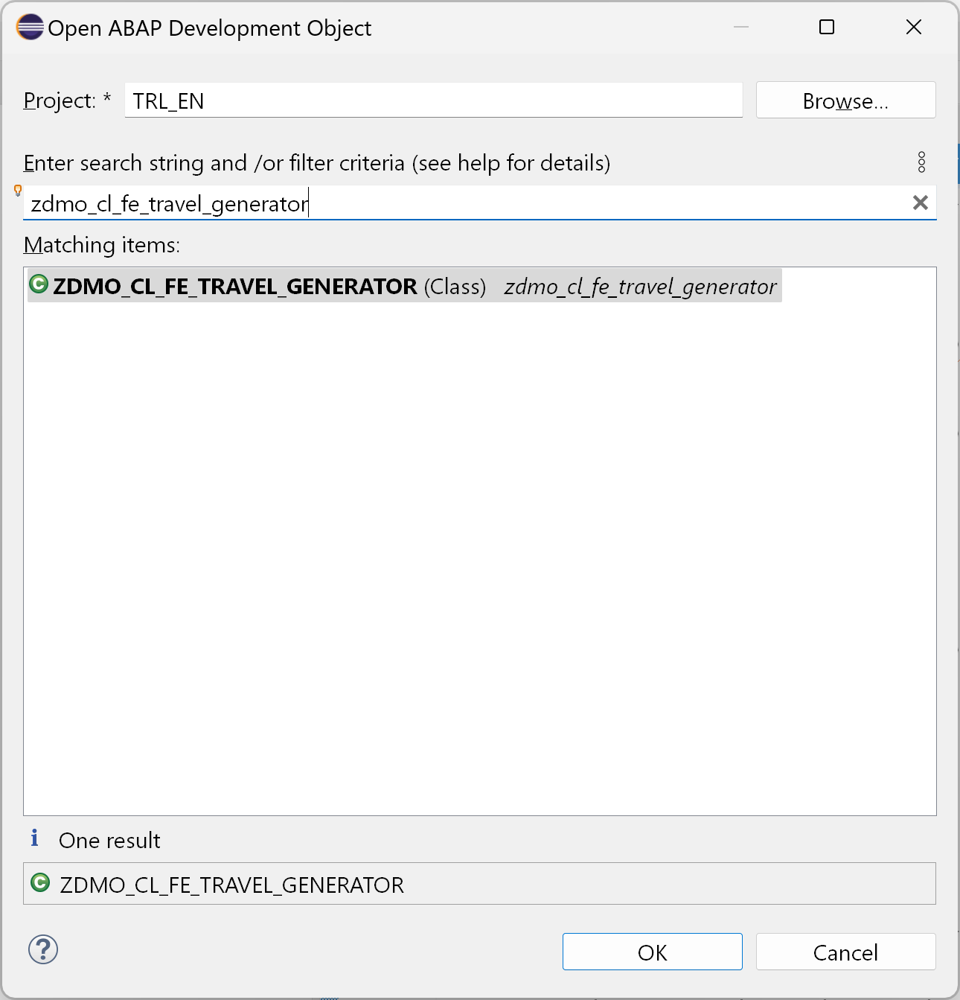
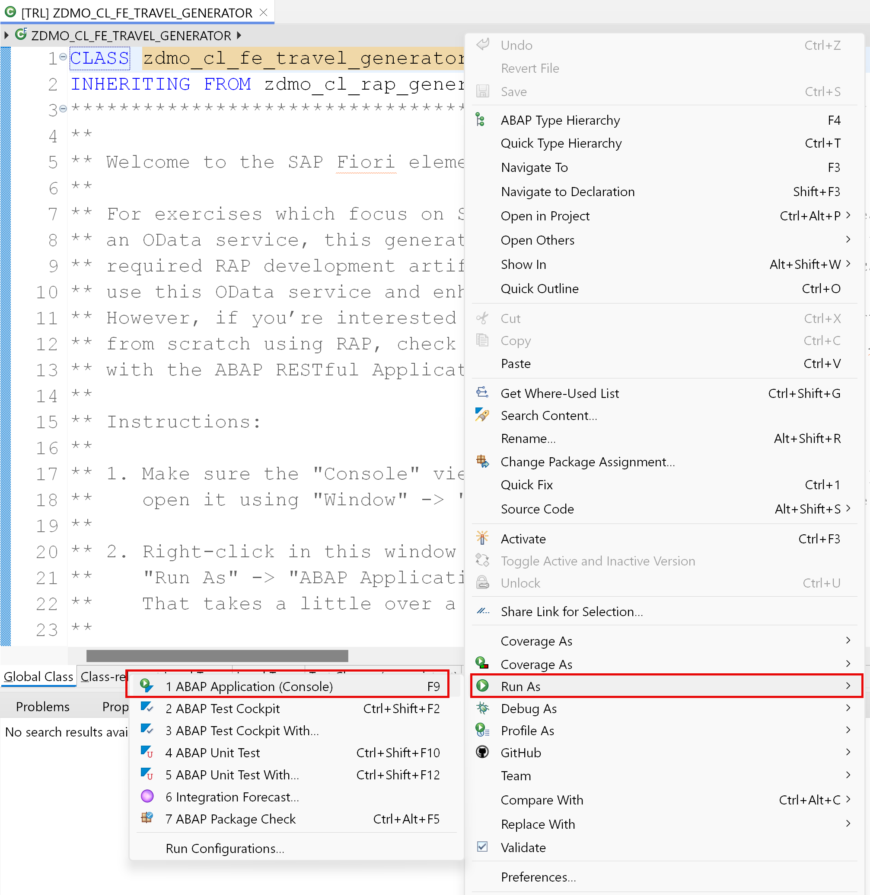
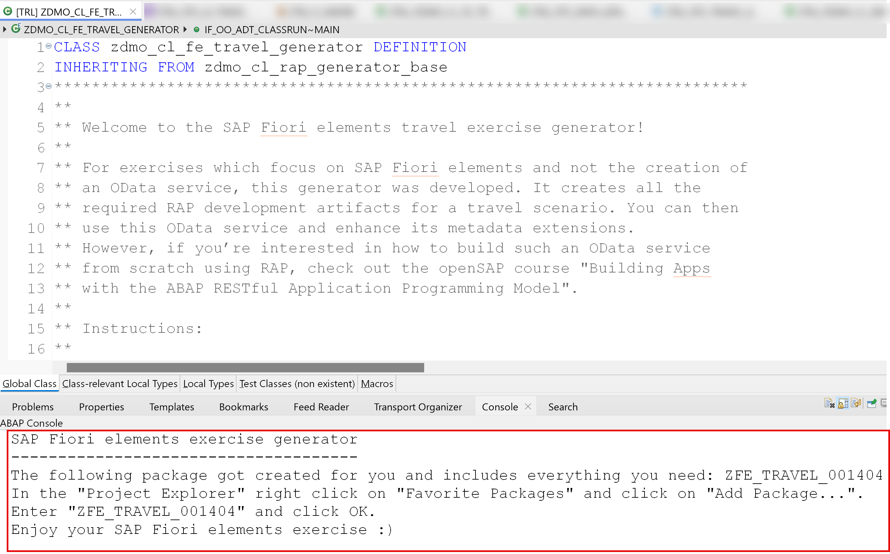
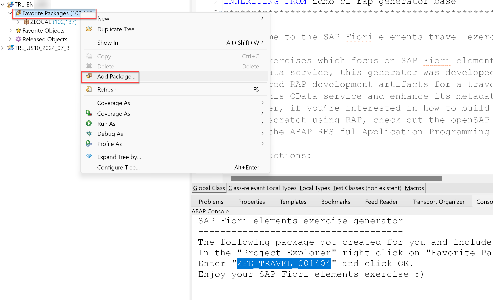
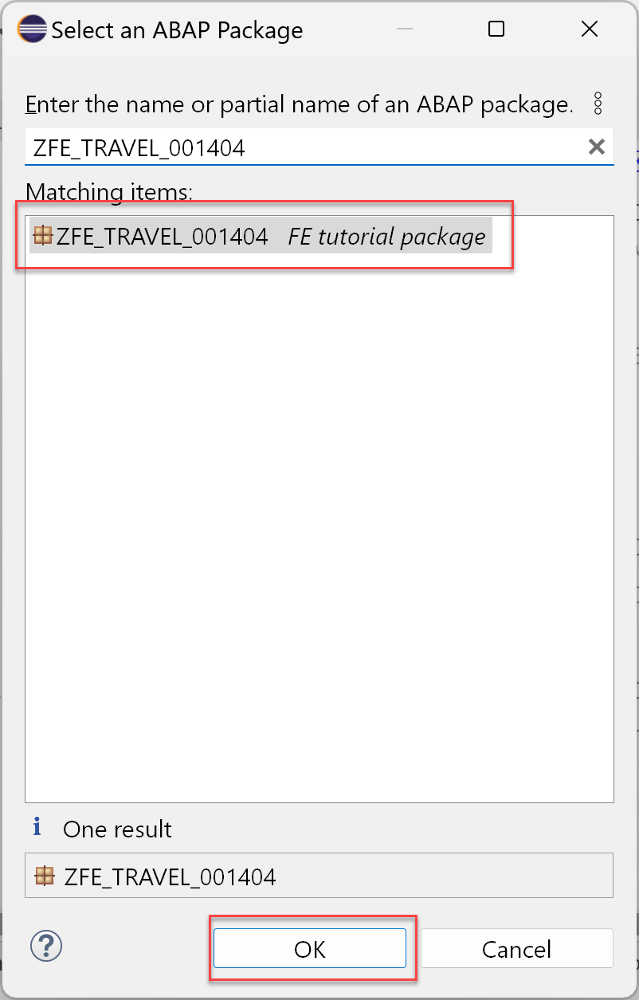
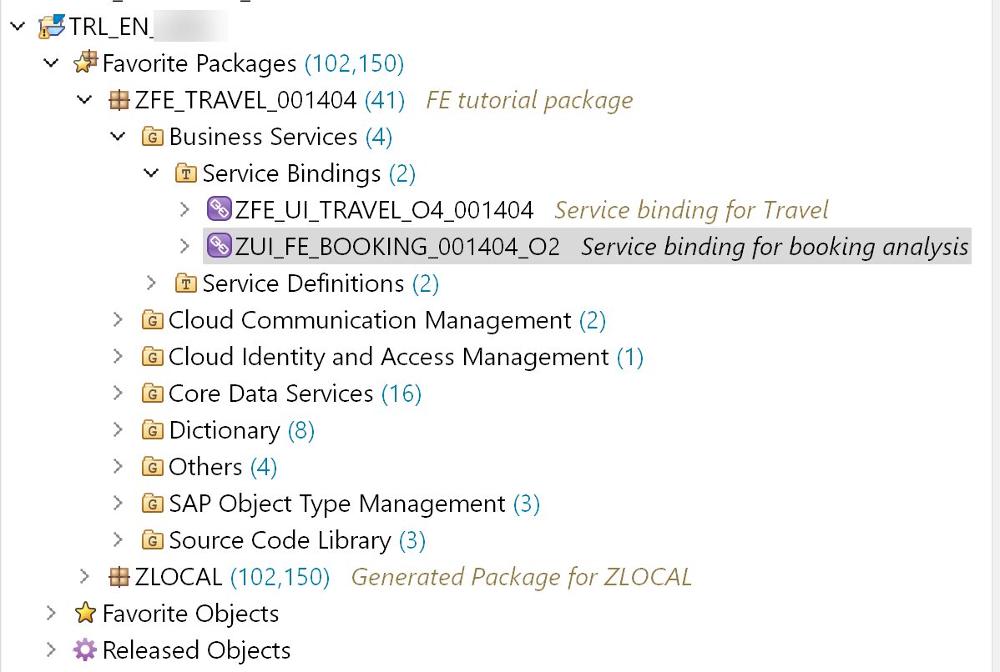
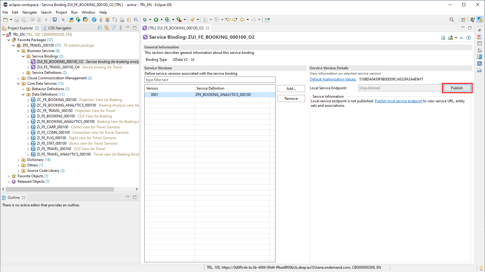

# Hands-on exercise for week 1 unit 5: Creating an OData service with ABAP RESTful Application Programming Model

## Previous exercise
[Hands-On exercise for week 1 unit 4: Preparing your ABAP development environment](unit4.md)

## Video on openSAP.com platform
[Creating an OData service with ABAP RESTful Application Programming Model](https://open.sap.com/courses/fiori-ea1/items/4Pnp5wuhKwu519vkyAlBAn)

## Introduction
This unit explains how to create individual RAP based OData services, which will be used within all the steps of the upcoming units.

To learn more about the SAP ABAP RESTful Application Programming Model (RAP), refer to the tutorial [Get to Know the ABAP RESTful Application Programming Model](https://developers.sap.com/tutorials/abap-environment-restful-programming-model.html) or take the [openSAP course on RAP](https://open.sap.com/courses/cp13).

You will learn how to
  - generate RAP services as a preparation for the following exercises
  - publish and test the RAP services using the preview option of the ABAP Development Tools

**Prerequisite: You have performed all previous exercises of this course.**

## Step 1. Start the service generator
The exercises of this course require an individual OData service having a unique suffix for each participant. This is necessary due to the fact, that within a specific ABAP cloud backend system all the development objects (e.g. packages, data-elements, classes, etc.) are globally available for all trial users who are connected to the same system. Since the creation of such an OData service is not the main part of these tutorials, a service generator is used to quickly create an individual service.

>Whenever your unique suffix for creating objects is needed, the object names within this tutorial are named with suffix "######". For the screenshots taken from a real service, the suffix "000100" was used.

1. Load the ABAP generator class

    Be sure to have opened the ABAP perspective within the ABAP development tools. In case you don´t see the ABAP perspective icon on top right of the application (see screenshot below), load the ABAP perspective by **Window** > **Perspective** > **Open Perspective** > **Other...** and choose the **ABAP** entry within the list of perspectives. Click **Open** to confirm the dialog.

    

    Now click the toolbar action **Open ABAP development object** to load the ABAP class that is needed to generate the service.    
    Note that in the corresponding video we showed how to access the action **Open ABAP development object** via the Navigate menu.

    

    The name of the class is **`zdmo_cl_fe_travel_generator`**. Select the class within the **Open ABAP Development Object** dialog and confirm the dialog by pressing the **OK** button.

    

2. Start the generator class

    As soon as the class is loaded within the editor, open the context menu via right mouse click and start the service by clicking on **Run As** > **ABAP Application (Console)**.

    

    The generation of the service needs roughly a minute. After the process has finished you will see a console message similar to the message shown in the screenshot below.

    

3. Assign the new package to your favorite packages

    To keep a better overview on your packages, add the generated package containing the service to your favorite packages by right clicking on the **Favorite Packages** container and choosing the **Add Package...** option.

    

    Enter the name of your package **`ZFE_TRAVEL_######`** shown in the console message in the dialog and confirm by pressing the **OK** button.

    

    Now you see the package assigned to your favorite packages.

    

## Step 2. Publish the services
1. Publish the OData V2 service

    To be able to use your service within applications, the service has to be published. This can be done by opening the service binding file `ZUI_FE_BOOKING_######_O2` in the **Business Services** > **Service Bindings** folder and pressing the **Publish** button. You will see a progress bar while the process is running which takes again roughly one minute.
    Note that we will need this OData V2 service for the Analytical List Page and the Overview Page which we will create in week 3.
    
    

2. Publish the OData V4 service

    To be able to use your service within applications, the service has to be published. This can be done by opening the service binding file `ZUI_FE_TRAVEL_######_O4` in the **Business Services** > **Service Bindings** folder and pressing the **Publish** button. You will see a progress bar while the process is running which takes again roughly one minute.
    Note that we will need this OData V4 service for the List Report, the Object Page and the Overview Page which we will create in weeks 1 and 2.

    

## Summary
You have completed the exercise!
In this unit, you have learned 
- How to generate the back-end artifacts and the OData services you need to build the travel-related apps

## Next Exercise
[Week 1 Unit 6: Creating a list report](unit6.md)
