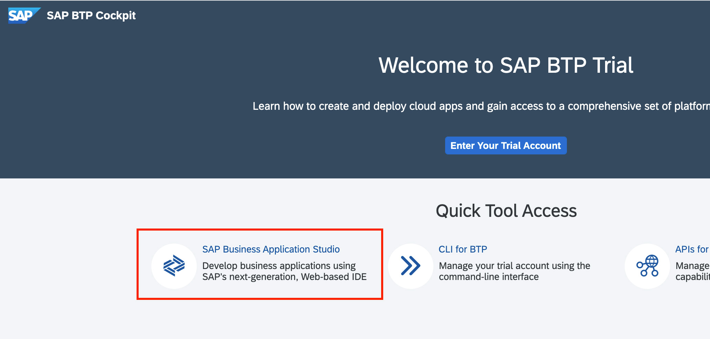

# Hands-on exercise for week 2 unit 3: Preparing your front-end development environment

## Previous exercise
[Hands-On exercise for week 2 unit 1: Creating an object page](unit1.md)

## Video on openSAP.com platform
[Preparing your front-end development environment](https://open.sap.com/courses/fiori-ea1/items/2gebfdghs3vTn6HeVVpSQl)

## Introduction
In this unit, you will learn how to set up your front-end development environment before you start creating your SAP Fiori application.

**Prerequisite: You have performed all previous exercises of this course.**

## Step 1. Creating the development Space in SAP Business Application Studio
1. Open the [Welcome to SAP BTP Trial](https://account.hanatrial.ondemand.com/trial/#/home/trial) page and click on **SAP Business Application Studio**.

   
   

2. When you launch SAP Business Application Studio, you will see a page similar to the screenshot below showing information about the different development spaces. Click the  **Create Dev Space** button to create a new development space.

      
   

3. Now enter text **SAP_Fiori** in field **Create a New Dev Space** and select the **SAP Fiori** type for your development space. Press **Create Dev Space** to confirm your entries.

    

    Your newly created development space is now listed in the overview page. Wait until the status has changed from **STARTING** to **RUNNING** which takes some time.
    
    

4. Click the name of your development space which is provided as a link as soon as the development space is started to open the SAP Business Application Studio.

    
   
    At this point SAP Business Application Studio should be started with your dev space showing the welcome page.

## Summary
You have completed the exercise!
In this unit, you have learned how to launch and configure SAP Business Application Studio (as your front-end development environment) for creating your SAP Fiori application, using the SAP Business Technology Platform account.

## Next Exercise
[Week 2 Unit 4: Generating the list report – object page app](unit4.md)
