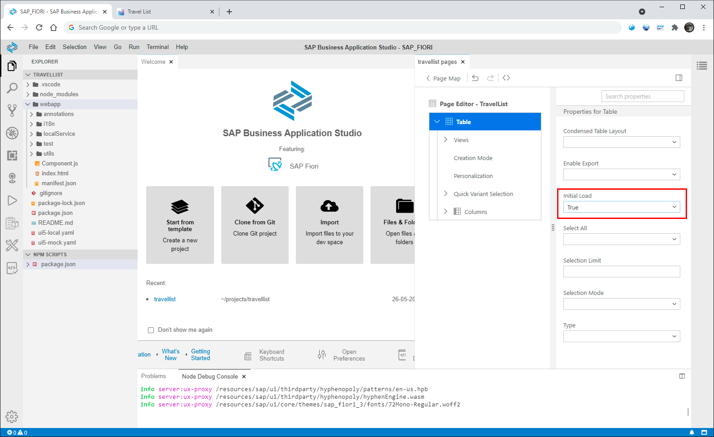
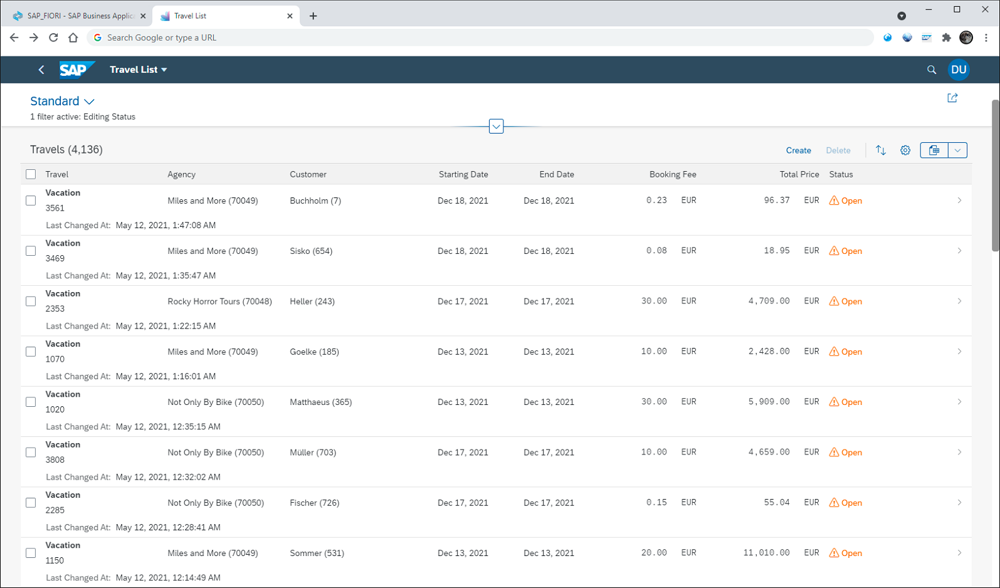

# Hands-on exercise for week 2 unit 5: Configuring the app

## Previous exercise
[Hands-On exercise for week 2 unit 4: Generating the list report – object page app](unit4.md)

## Video on openSAP.com platform
[Configuring the app](https://open.sap.com/courses/fiori-ea1/items/4IKfdIpzsrvKOH5sYIIid3)

## Introduction
In this unit you will configure the travel list - travel details app without any code using the application modeler.

The application modeler manages the structure of your app. It includes the page map and the page editor. The page map visualizes and lets you change the page structure of your app as well as the layout settings. It also enables adding new pages to application structure. The page editor let's you change settings of controls and other entities an individual page.  

You will learn
  - How you can easily configure your SAP Fiori elements app using the SAP Fiori tools – application modeler extension
  - How to apply the flexible column layout
  - Which settings you can change using the page editor

**Prerequisite: You have performed all previous exercises of this course.**

## Step 1. Activate Flexible Column Layout
In this step you will activate the flexible column layout. This feature allows to have the list report and the object page open at the same time without the need to switch the UI when changing the selection of items in the list report.

>⚠️ Firefox currently has a bug that it does not treat subdomains of localhost as secure. When you open the "Page Map" or another tool of the Fiori tools and the tab stays empty please refresh the page by pressing F5 or click the reload button of the browser. After reloading the page the tool should show up. 

1. In the SAP Business Application Studio open the context menu by right clicking on your `webapp` folder and select the menu entry **Show Page Map**.

    

2. The Page Map tool opens at the right part of SAP Business Application Studio. In the left area it shows the UI structure of your application listing the tiles for your list report and for the object page. On the right area labeled as **Global Page Settings** you can select the **Layout Settings**. Choose option **Flexible Column Layout** and then select the **Mid-Expanded** option for the two columns layout. Leave the default for the three columns layout unchanged.

    When you work with the latest version of SAP Fiori tools there is no **Apply** button anymore. The change will immediately be applied then.

    

3. Switch your browser tab to show your application again. Refresh the application and click the **Go** button to load data into the list report table. Select any of the items within the list report table to navigate to the object page.

    

    Now the object page will open but the list report stays open on the left side of the UI showing both at the same time. When you switch items within the list report the object page will be updated automatically.

## Step 2. Activate initial loading of data in the list report
In the page editor You can activate the initial load feature that will trigger the loading of data within the list report automatically, i.e. without the need of pressing the **Go** button.

1. Open the page map tool once again as shown in the previous step by clicking the **Show Page Map** option in the context menu of your application folder.

2. In the UI structure of your application shown by the page map tool, click the **pencil** button within the **List Report** tile to open the page editor.

    

3. Now the structure of the list report is shown. Press the **table** node to open the properties of the list report table.

    

4. In the list of **Properties for table** select the value **True** (update SAPUI5 1.90: **Enabled**) for the property **Initial Load**. This setting is immediately active without the need of any confirmation.

    

5. Switch to the browser tab that contains the application. Refresh your application and you will see, that the data of the list report table is loaded immediately without pressing the **Go** button. 

    

## Summary
You have completed the exercise!
In this unit, you have learned how you can easily configure your SAP Fiori elements app using the SAP Fiori tools – application modeler extension

## Next Exercise
[Week 2 Unit 6: Adding custom controls and logic](unit6.md)
