# Hands-on exercise for week 3 unit 5:<br/>Building an SAP Fiori elements app with an external OData service

## Previous exercise
[Hands-On exercise for week 3 unit 4: Deploying your SAP Fiori elements app](unit4.md)

## Video on openSAP.com platform
[Building an SAP Fiori elements app with an external OData service](https://open.sap.com/courses/fiori-ea1/items/PKrz5924rGB2jGtWbf5QS)
## Introduction
In this unit, you will learn how to use the annotation LSP features such as code completion, internationalization (i18n) support and quick fixes for building a basic SAP Fiori app based on the sample OData service from OData.org. 

In this exercise, the screenshots illustrating the steps are taken from the Visual Studio Code. You can however use SAP Business Application Studio for these exercises, the steps are the same. The minor differences are described directly in the steps.

## Step 1. Generate SAP Fiori elements project with an external OData service
The first step is to generate your SAP Fiori elements project using the SAP Fiori tools application generator. This project will have a standard file structure.
1. Click **View** and choose **Command Palette\.\..** in Visual Studio Code or **Find Command\.\..** in SAP Business Application Studio.

    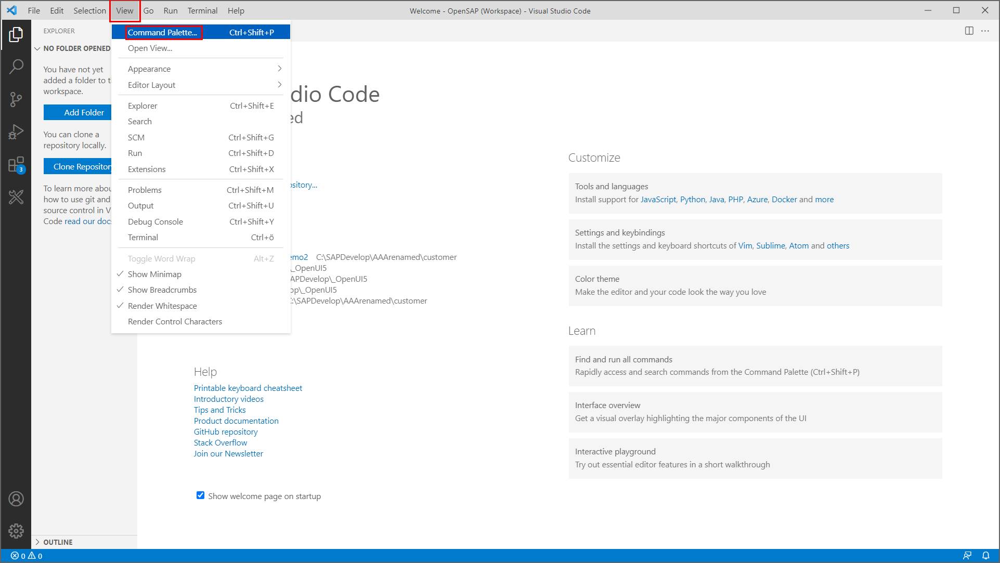

2. Click **Fiori: Open Application Generator.** 

    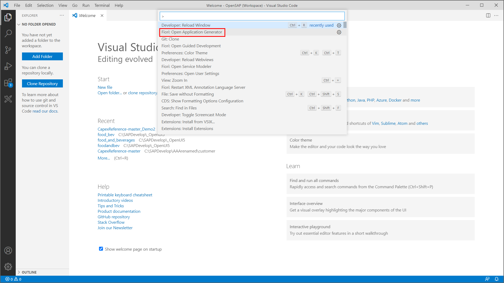

3.  In page **Floorplan Selection** , select the tile **List Report Object Page**  and click **Next**. 

    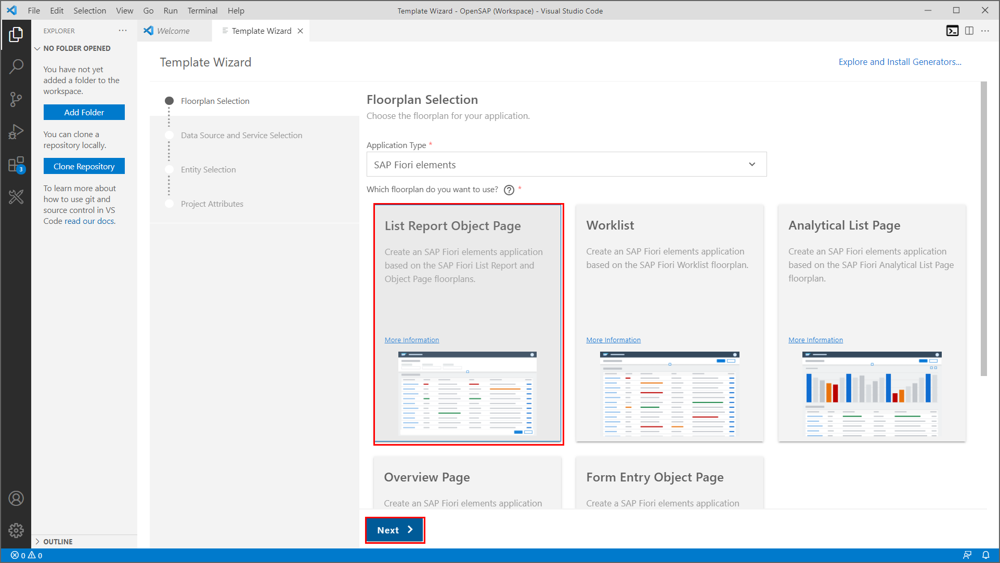

4. Now you connect the application template with the OData service. Select the data source for the project. 

    Since you use the external service, choose **Connect to an OData Service** from the dropdown field **Data source**. 

     The OData service used in this unit is a sample read\-only OData v2 service from OData.org. In the **OData Service URL**  field, enter the link to this service: https://services.odata.org/V2/Northwind/Northwind.svc/. 

    Click **Next**.

    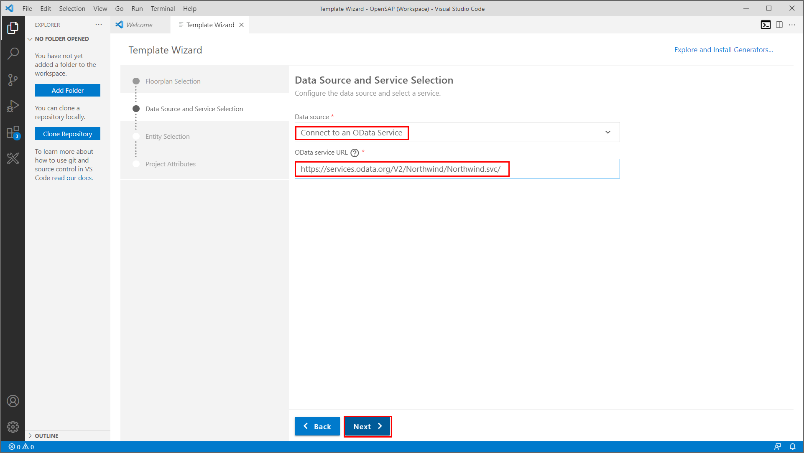

5. For your application you need to choose the main entity set from the OData service. Objects of this type will be displayed in the list report. 

    In your application, start with **Products** as your **Main entity**. As your application will not have a sub\-object page, you do not need a navigation entity.

    Click **Next**.

    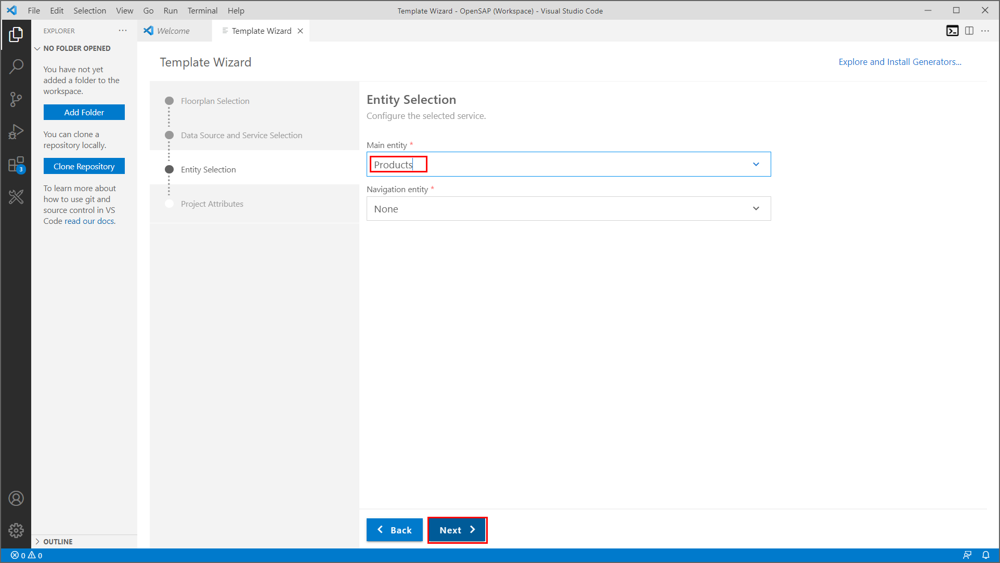

6. Maintain specific attributes of the application project as follows:

   **Module name** : foodandbev

   **Application title** : Food and Beverages

   **Application Namespace** : sap.fe.demo

   **Description** : Food and beverages for serving on board

    **Project folder path** : when working in SAP business application studio, choose folder path `/home/user/projects`. You can choose a different path but make sure it is the same as for all the other applications during this course.   

    When working with the Visual Studio Code, choose your local folder.
 
    Click **Finish**.


    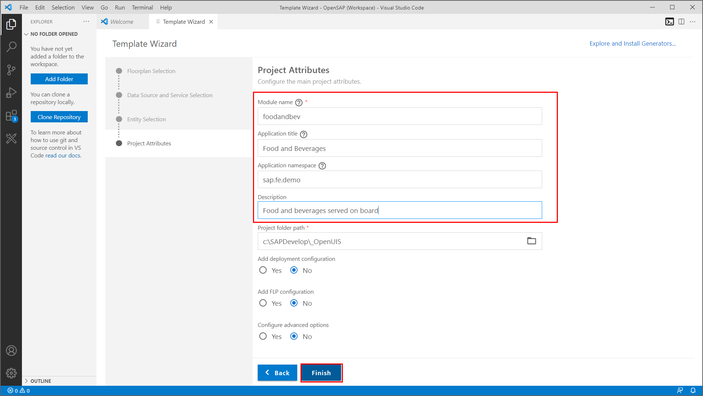

The new SAP Fiori elements application is now created from the template using the service and the configurations you provided in this step.

## Step 2. Define basic content   
In this step, you create your first XML annotations controlling the filter field and table in the list report application. For this, you use the code completion feature provided by the XML annotation LSP extension.

When the project is generated, you can open the local annotation file and start creating the XML annotations. For this, first make sure the **Project folder path** you selected during the application generation is open in the **Explorer** pane. If the selected project folder path is not opened by default, you can do so by going to **File** menu then select **Open Workspace** or **Open Folder** and choose the selected folder. Then, expand **foodandbev/webapp/annotations** folder and  open the **annotation.xml** file with a double\-click.

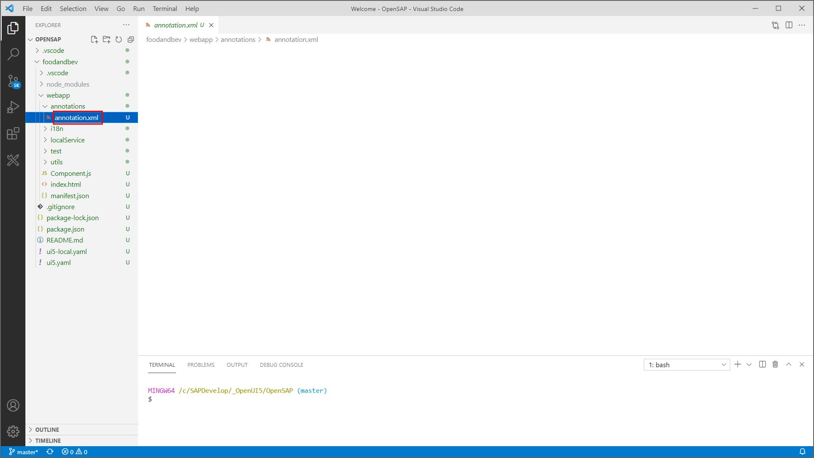

1. The local annotation file generated with the project already contains the references to the most commonly used annotation vocabularies as well as a reference to the service metadata and a schema where all the annotations should reside.

    Add a new line within the **Schema** tag. Then use the code completion to open the list of suggestions for the eligible content.

    To use the code completion, press **CTRL+Space** on Windows or **CMD+Space** on Mac

    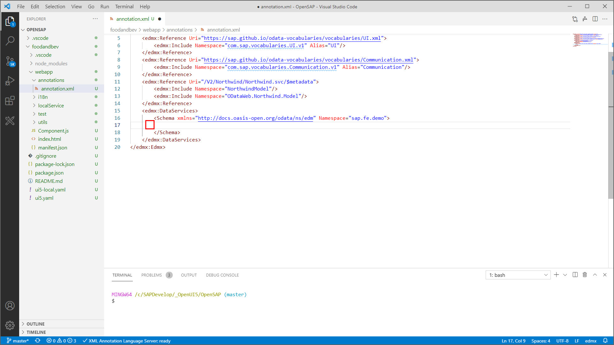

    Now choose **Annotations**  - the only available option suggested in the code completion list. 

    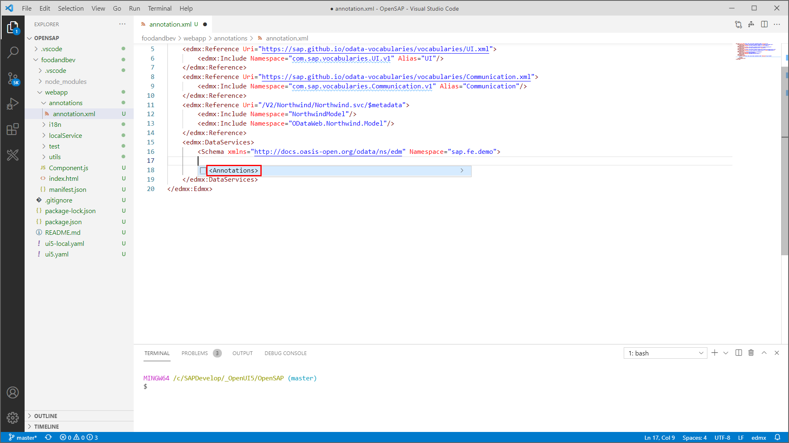

    The `Annotations` tag is added along with the `Target` attribute, which specifies the OData entity for the annotations.  To define the basic list report features, annotate the main entity type. For this, use the code completion **CTRL/CMD+Space** and choose the main entity type **Product**.

    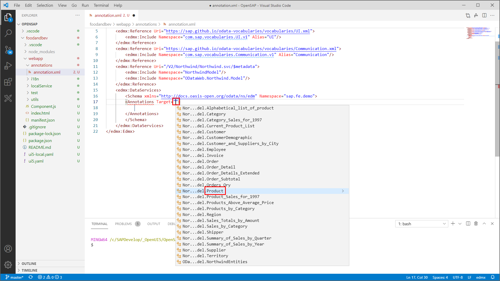

2. Now, you can apply annotations to the selected entity type, in this case to the entity `Product`. Start with adding a selection field to the filter bar. SAP Fiori elements floorplans use the annotation `UI.SelectionFields` to display the filter fields in the filter bar. 

    Press **Tab**  to place the cursor inside the `Annotations`  tag. Tab key lets you navigate to the next tab stop of the inserted code snippet as long as it is active. When you navigate outside the code snippet or click elsewhere in it, the code snippet becomes inactive and you need to position the cursor manually.
    
    Use the code completion **CTRL/CMD+Space** to view the list of annotations applicable to the entity type.
     
    Choose the **UI.SelectionFields** annotation in the code completion list to apply it. To filter out the list of suggestions, you can type in a few characters, for example **se** 

    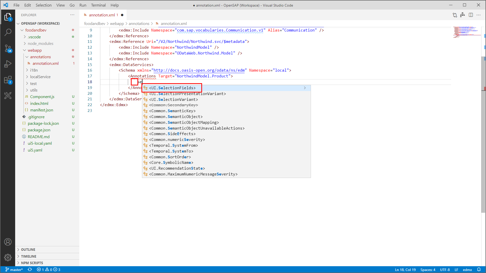

    Now you can choose the property to be used as a filter field. Press **Tab**  to place the cursor inside the `PropertyPath` tag and use the code completion **CTRL/CMD+Space** to view the list of available entity type properties.

    Choose **ProductName** to display it as a filter.

    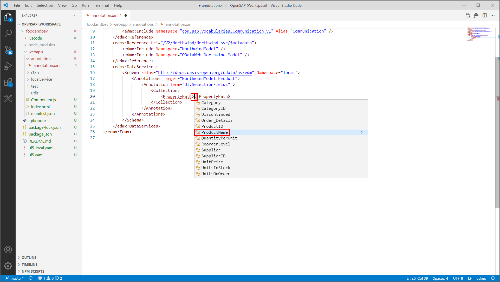

    The filter field is defined. The resulting annotation is as shown in the coding example below.
    ```
                <Annotation Term="UI.SelectionFields">
                    <Collection>
                        <PropertyPath>ProductName</PropertyPath>
                    </Collection>
                </Annotation>
    ```
3. Now, apply the `UI.LineItem` annotation to the main entity type to define the List Report table. 

    As our main entity type is already annotated in the local annotation file, there is no need to add the `Annotations` tag again. Just add a new line after the `</Annotation>`  tag and use the code completion to choose the desired annotation.

    To filter out the list of suggestions, type in a few characters, for example **Line**.

    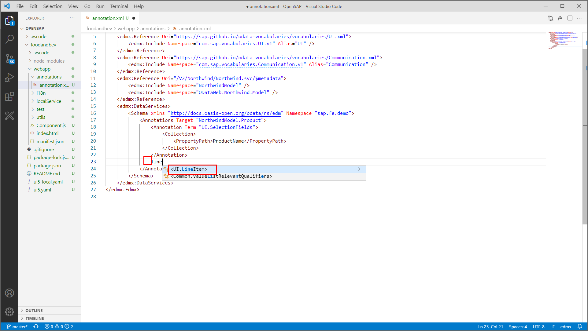


4. Next, define the table columns. In UI.LineItem, they are represented by a collection of UI.DataFields.  

    Press **Tab**  to place the cursor in the `Collection`  tag and use the code completion. 
    
    Choose **Record "DataField"**.

    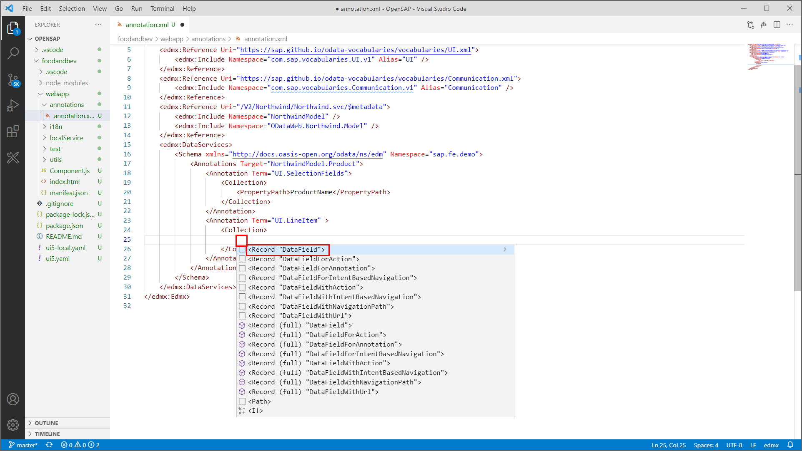

    The cursor automatically moves to the next tab stop in the code snippet. 
    
    Use the code completion **CTRL/CMD+Space** to choose the value expression type for the first DataField \(column\).
    
    Choose **Path** as your column will be defined by a path to an entity type property.

    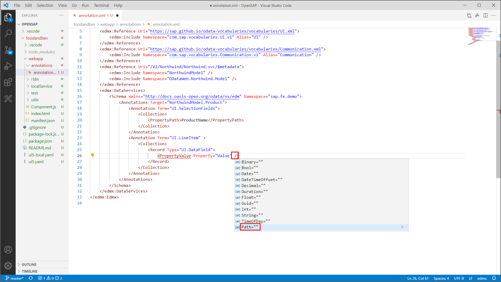

    Now, use the code completion again and choose **ProductID** as a value defining the content of the first table column.

    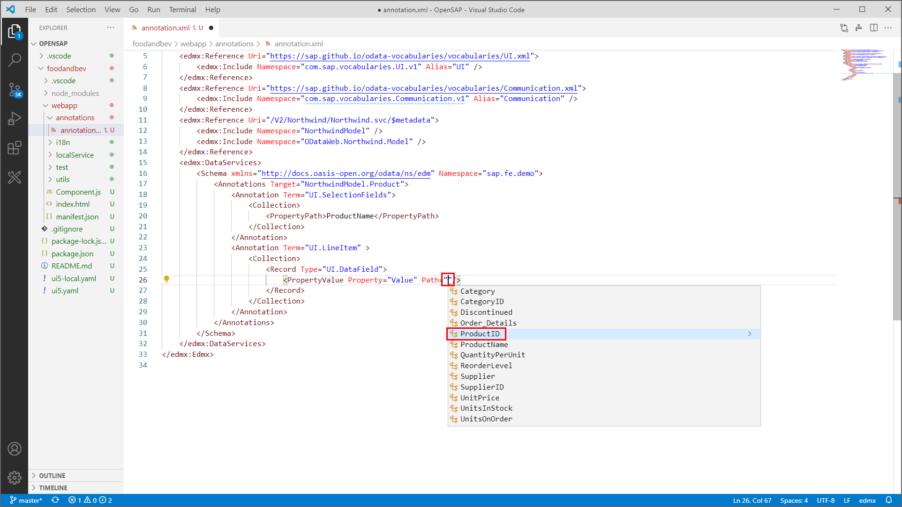

5. Now, define the remaining table columns by adding  UI.DataField records to this UI.LineItem  annotation for the following properties:

    **ProductName** 

    **QuantityPerUnit** 

    **ReorderLevel** 

    **UnitsInStock** 

    **UnitPrice** 

    The resulting annotation is as shown in the code fragment below.
    ```
                <Annotation Term="UI.LineItem">
                    <Collection>
                        <Record Type="UI.DataField">
                            <PropertyValue Property="Value" Path="ProductID" />
                        </Record>
                        <Record Type="UI.DataField">
                            <PropertyValue Property="Value" Path="ProductName" />
                        </Record>
                        <Record Type="UI.DataField">
                            <PropertyValue Property="Value" Path="QuantityPerUnit" />
                        </Record>
                        <Record Type="UI.DataField">
                            <PropertyValue Property="Value" Path="ReorderLevel" />
                        </Record>
                        <Record Type="UI.DataField">
                            <PropertyValue Property="Value" Path="UnitsInStock" />
                        </Record>
                        <Record Type="UI.DataField">
                            <PropertyValue Property="Value" Path="UnitPrice" />
                        </Record>
                    </Collection>
                </Annotation>
    ```
    The table for the List Report Page is now defined.

6. **Save** the annotation file. 

    Note: In SAP Business Application Studio, auto save feature is enabled by default.

    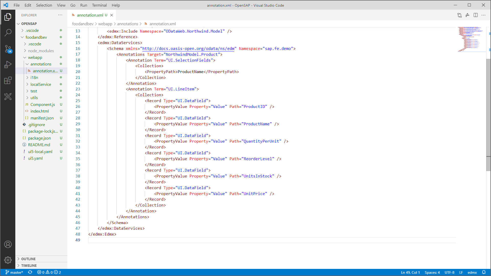

7. To start the preview, right\-click on the **webapp** folder in the **Explorer** pane and click **Preview Application**. 

    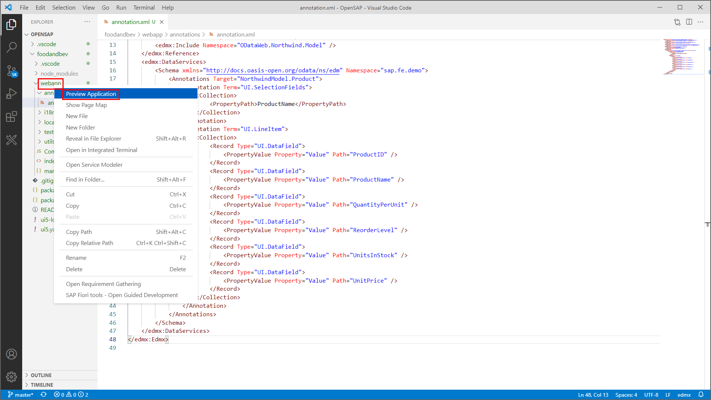

8. When prompted, choose **start fiori run**.

    The Food and Beverages application preview opens in the browser.

    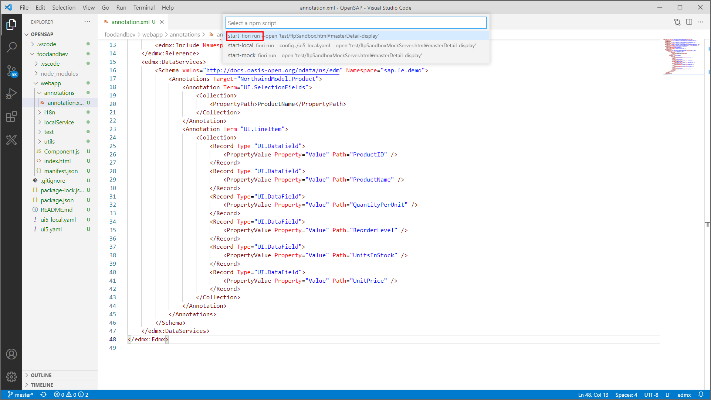

9. To populate the table with data, click **Go**.

    

   The SAP Fiori elements application now contains the filter fields and the table defined by annotations added in the local annotation.xml file.

    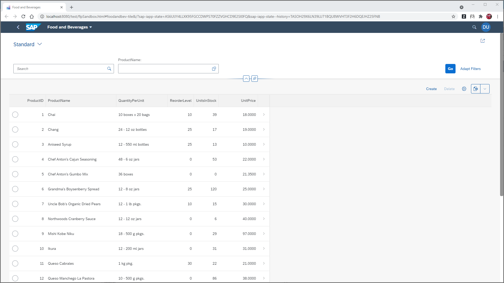

## Step 3. Define translatable filter labels  
Now, you change the label of the selection field to `Product`. For this, the `Common.Label` annotation should be applied to the property used for the filter field -  in our case the relevant property is `ProductName`. For this, you use the code completion feature provided by the XML annotation LSP extension. 

Note that this label will be used by default for each occurrence of this property in the app. 

Then, you use the i18n support features of XML Annotation LSP to  prepare it for internationalization:
- **Diagnostics** will warn you that your label is not internationalized
 - **Quick Fix action** will let you generate the translation key and substitute the plain string with a reference to it.
 - **Go To Definition** or **Peek \-&gt; Peek Definition** will navigate you to the place in the `i18n.properties` file for viewing or editing the generated key/value pairs.

1. Add a target to annotate: insert another `Annotations`  tag in to the annotation schema and use the code completion to view the list of available targets. 

    As the filter field refers to a property of the main entity type, first choose the main entity type **Product**. 
    
    Then type in **/** and choose its property used in the filter field \- **ProductName**.
    
    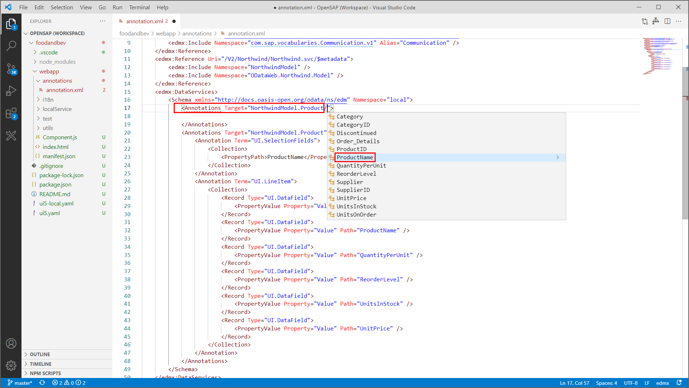


2. Next, apply the annotation: within the `Annotations` tag, use the code completion to add a `Common.Label`  annotation. 

    Set the annotation value to **Product**. 

    The resulting annotation is as shown in the code fragment below.
    ```
            <Annotations Target="NorthwindModel.Product/ProductName">
                <Annotation Term="Common.Label" String="Product"/>
            </Annotations>
    ```
3. To enable the label for translation, you can use a quick fix action. For this, first **hover** on the annotation value to view the warning. Then click **Quick Fix** to get the list of available actions.

    As an alternative, you can place the cursor inside the string value and click on the **Show Fixes**  icon to view the list of the quick fix actions for it. 

    

4. Click **Generate a text key 'Product'**.

    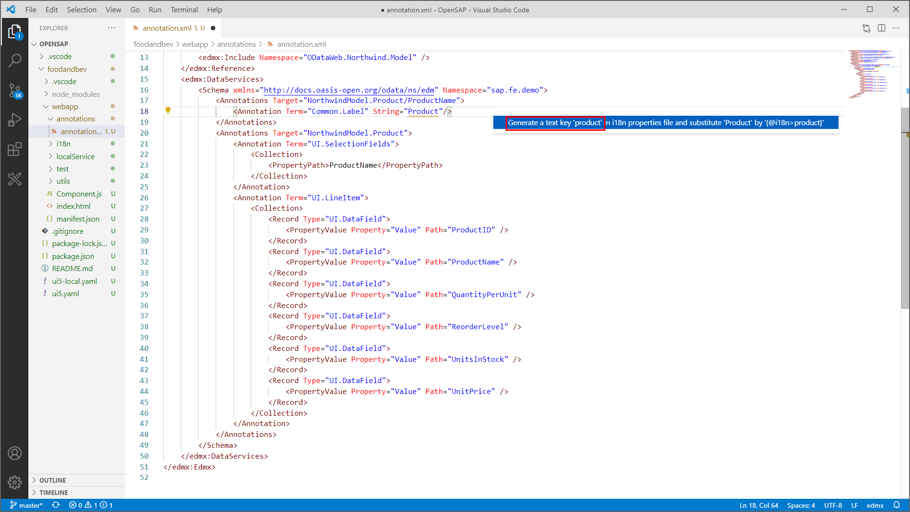

    The text key for the string value gets generated and stored along with the text value in the `i18n.properties` file of the project and can be subsequently used for the internationalization of the app. The string value is substituted with the reference to that key as shown in the code fragment below.
    ```
            <Annotations Target="NorthwindModel.Product/ProductName">
                <Annotation Term="Common.Label" String="{@i18n>product}"/>
            </Annotations>
    ```
    To view the i18n details, **hover** on the text key reference while pressing **CTRL**. To navigate to the generated key in the i18n.properties file, use **CTRL+Click** on the generated text key reference. i18n properties file with the newly created text key opens in the new tab for viewing or editing.    
    
    Alternatively, you can open the context menu and click **Go To Definition**.

    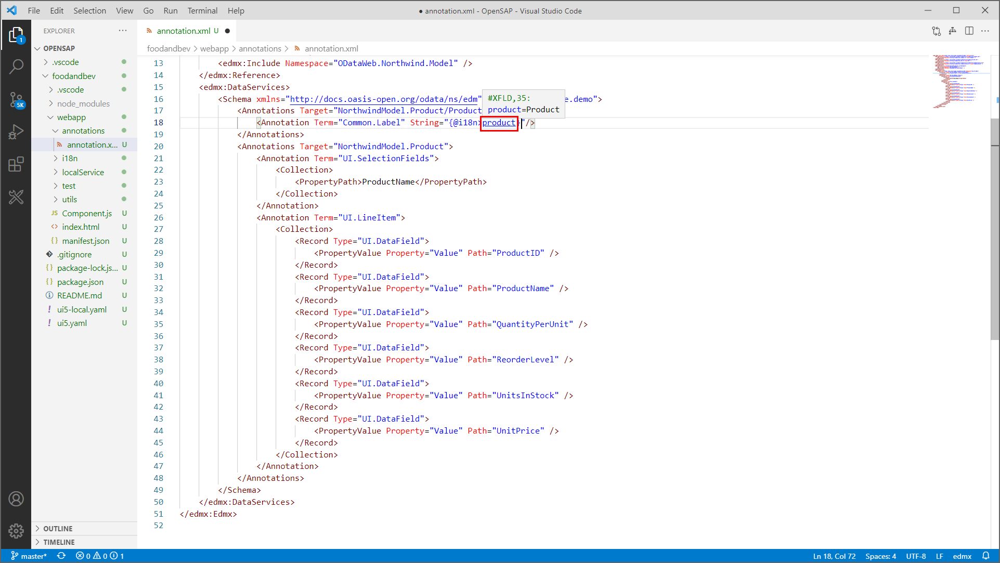

    To view or edit the text properties without leaving the file, place the cursor in the text key reference and press **ALT+F12**.

    Alternatively, you can use the context menu option **Peek \-&gt; Peek Definition**. 

    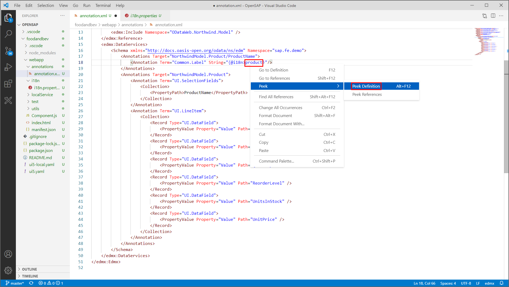

    The i18n properties file with the newly created text key opens in the pop\-up for viewing or editing.

    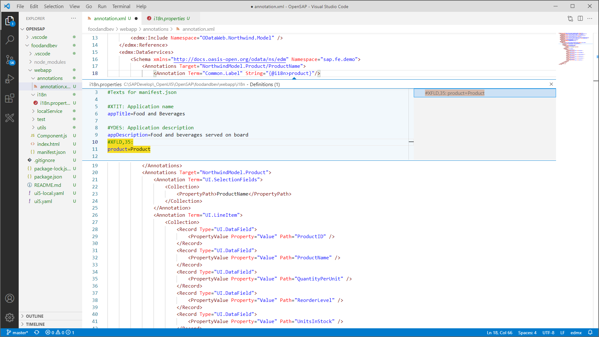

5. **Save** the annotation file and switch to the application preview in the browser.

    Note: In SAP Business Application Studio, auto save feature is enabled by default.

    The label for the filter field and the respective table column is updated.

    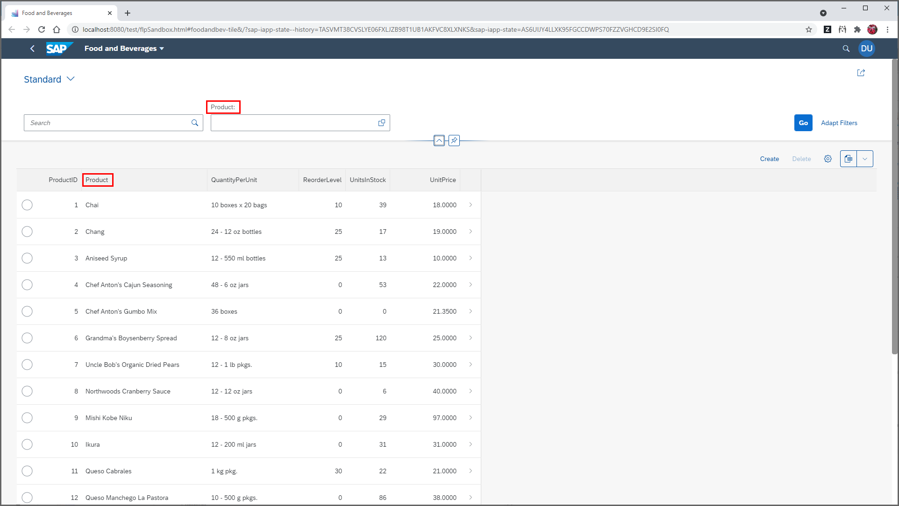

## Step 4. Combine product name and ID in one column
A well designed SAP Fiori app should always show the description or object name together with the object ID for better readability. In this step, you replace the content of the `Product ID` column with the combination of `Product Name` and `Product ID`.  For this, you use the code completion feature provided by the XML annotation LSP extension. 

1. Add the annotation target for the key property **ProductID** and apply the **Common.Text** annotation to it.

    By default, the value of the `Common.Text` annotation is represented by the string value. However, in this case, the text should be different for each product to be relevant, so it should be represented as a path to the property `ProductName`. 
    
    For this, delete the expression type **String=" "**.
    
    Then use the code completion to add **Path** expression and then again to add **ProductName** as its value. 
    
    The resulting annotation is as shown in the code fragment below.

    ```
            <Annotations Target="NorthwindModel.Product/ProductID">
                <Annotation Term="Common.Text" Path="ProductName"/>
            </Annotations>
    ```

    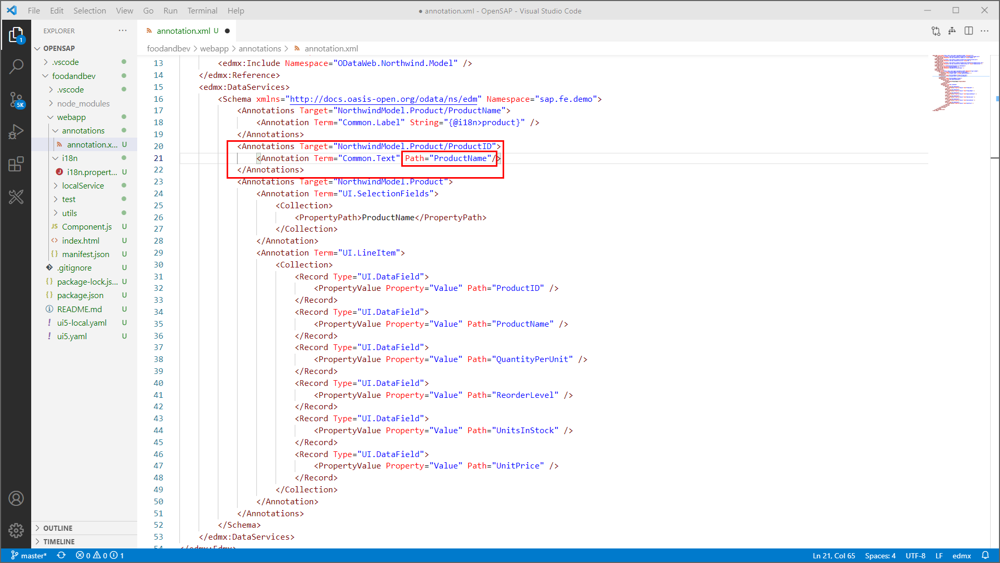

2. As `Common.Text` annotation already takes care of displaying the product name together with the product ID in the first column, a separate column for the product name becomes redundant. Delete the **UI.DataField**  record for **ProductName**  from the `UI.LineItem` to avoid this redundancy.

    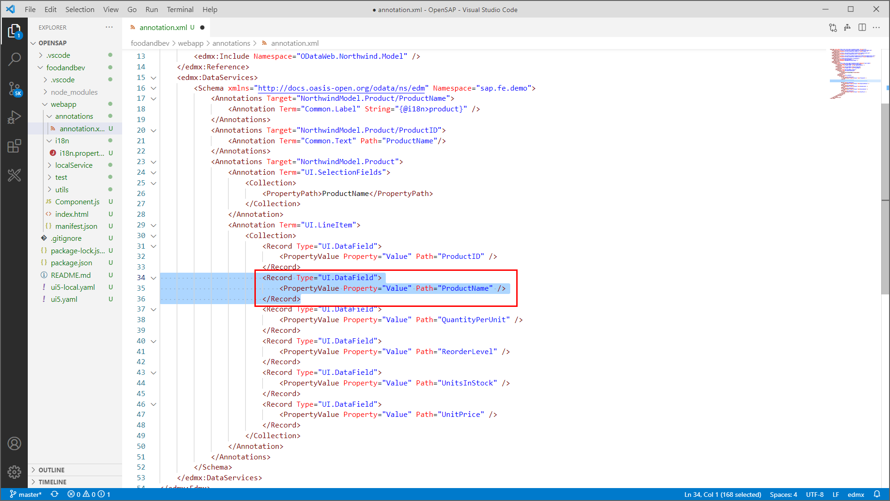

3. **Save** the annotation file and switch to the application preview in the browser.

    Note: In SAP Business Application Studio, auto save feature is enabled by default.

    `ProductName` value is now displayed along with that for `ProductID`  in the first column.

    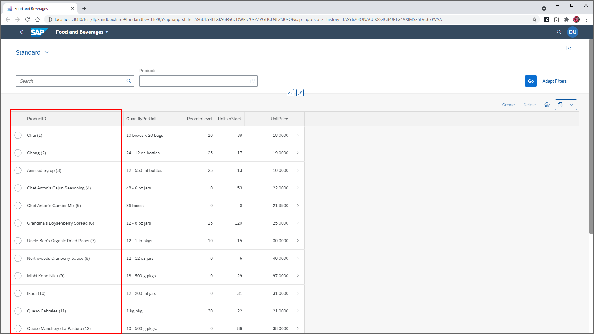


4. To visually indicate that the product ID is a semantic key for our the main entity type, annotate this entity type with the **Common.SemanticKey**  annotation and set the **PropertyPath**  to **ProductID**.

    The resulting annotation is as shown in the code fragment below.

    ```
                <Annotation Term="Common.SemanticKey">
                    <Collection>
                        <PropertyPath>ProductID</PropertyPath>
                    </Collection>
                </Annotation>
    ```


    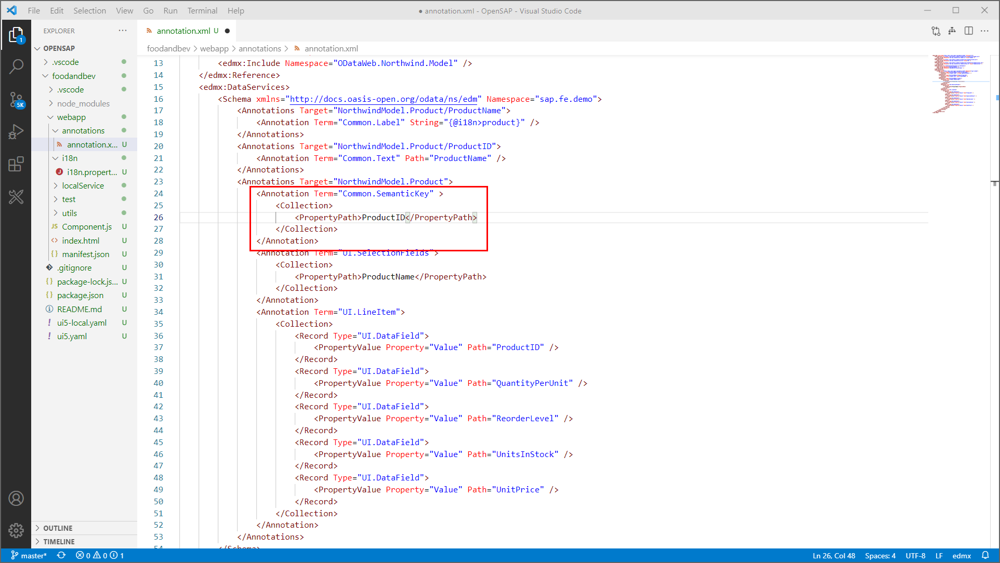

5. Save the annotation file and switch to the application preview in the browser. 

    Note: In SAP Business Application Studio, auto save feature is enabled by default.

    The values in the `ProductID`  column are now visually highlighted.

    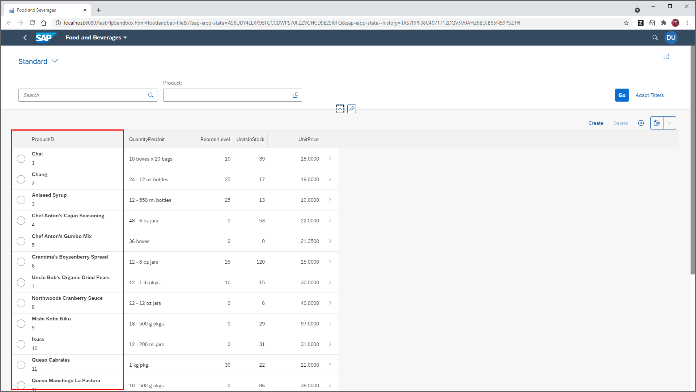

## Step 5. Define translatable column titles
In this step, you define the proper titles for table columns by adding the `Label` property to the `UI.DataField` records with the code completion feature of XML annotation LSP extension. Then you prepare them for internationalization. For this, you use the following assisting features:

- **Diagnostics** to get aware that your label is not internationalized
- **Code completion** to reuse the translation keys already existing in `i18n.properties` file
 - **Quick Fix action** to generate new the translation keys and substitute the plain string with a reference to it.
 
 You can also use **Go To Definition** or **Peek \-&gt; Peek Definition** will navigate you to the place in the `i18n.properties` file for viewing or editing the generated key/value pairs.

If there is no label defined for a table column, the label defined for the property referenced in the `DataField Value` is displayed in the column header. If this is not defined either, the property name is displayed instead. This often does not look user friendly, as it is technical, cannot contain spaces or special characters and is not available for translation. To avoid this, the label for each `UI.DataField` in the `UI.LineItem` should be defined and prepared for translation.

1. To add a column title, use code completion inside the **UI.DataField** record and add **Property Label**. 

    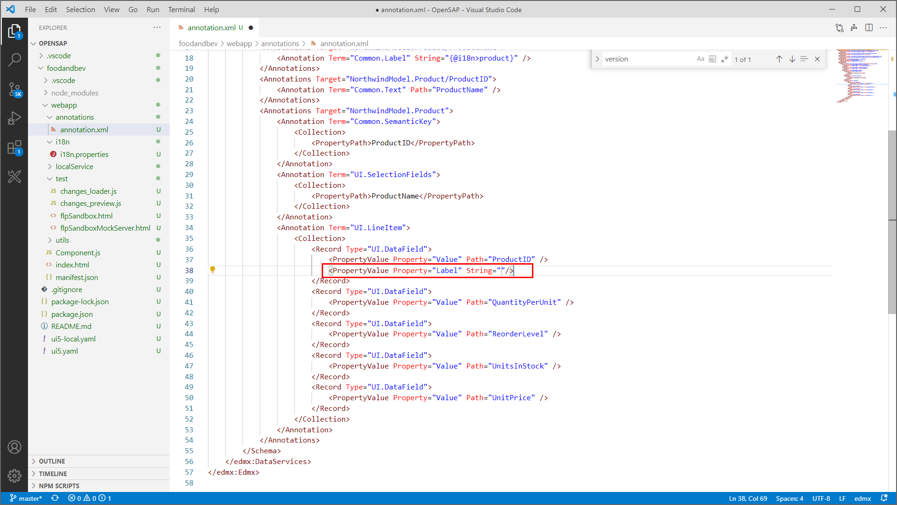


2. As a value, you can either add a new text string  or choose one of the text keys already existing in the `i18n.properties` file of your project.

    Reusing the existing texts whenever possible will lower the translation effort and reduce the related costs.
    
    Use the code completion again to choose one of the existing translatable texts. You can click the **Read More**  icon **&gt;** to view the i18n properties of the key highlighted in the code completion list. 

    To reuse the existing text key, use the code completion inside the `String` value and choose one of the suggested options. As **Product**  is already defined as a translatable text for the filter field, it can be reuses for the Product ID column as well. For this, choose the text key **{i18n&gt;product}**.

    ```
                <Record Type="UI.DataField">
                    <PropertyValue Property="Value" Path="ProductID"/>
                    <PropertyValue Property="Label" String="{@i18n>product}"/>
                </Record>
    ```

    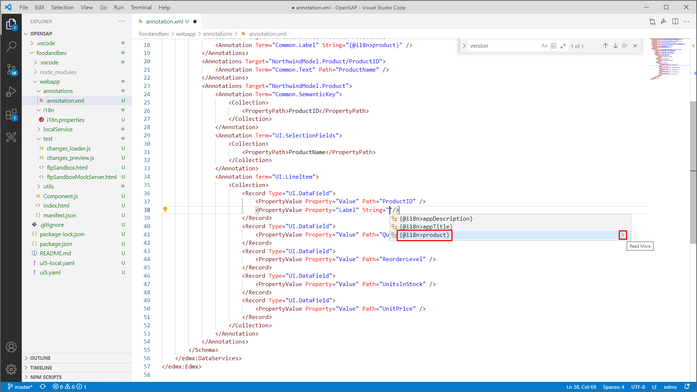


3. Similarly, add a Label property for the next UI.DataField. As the appropriate text does not exist in the i18n.properties file yet, type in a new one **Quantity per Unit**.
    ```
                <Record Type="UI.DataField">
                    <PropertyValue Property="Value" Path="QuantityPerUnit"/>
                    <PropertyValue Property="Label" String="Quantity per Unit"/>
                </Record>
    ```
    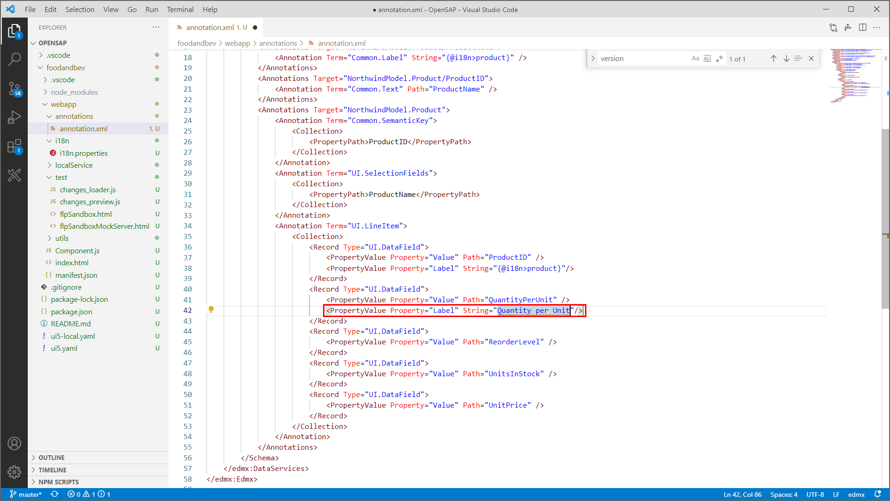

4. To prepare this text key for translation, you can use the dedicated Quick Fix action. To view the list of suggested Quick Fixes, place the cursor inside the string value and click **Show Fixes** .

    Alternatively, you can choose **Quick Fix** next to the warning message on hover or in the **Problems** view.

    Click on suggested action **Generate a tex key 'QuantityPerUnit'**.
    ```
                <Record Type="UI.DataField">
                    <PropertyValue Property="Value" Path="QuantityPerUnit" />
                    <PropertyValue Property="Label" String="{@i18n>quantityPerUnit}"/>
                </Record>
    ```

    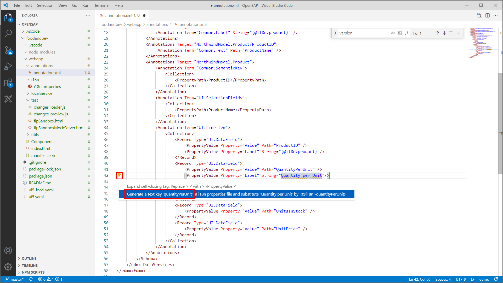


5. Repeat for the remaining **UI.DataField**  records. The `UI.LineItem` annotation now contains labels for all `UI.DataFields` and the texts for table column titles are now prepared for translation.
    ```
                <Annotation Term="UI.LineItem">
                    <Collection>
                        <Record Type="UI.DataField">
                            <PropertyValue Property="Value" Path="ProductID" />
                            <PropertyValue Property="Label" String="{@i18n>product}" />
                        </Record>
                        <Record Type="UI.DataField">
                            <PropertyValue Property="Value" Path="QuantityPerUnit" />
                            <PropertyValue Property="Label" String="{@i18n>quantityPerUnit}" />
                        </Record>
                        <Record Type="UI.DataField">
                            <PropertyValue Property="Value" Path="ReorderLevel" />
                            <PropertyValue Property="Label" String="{@i18n>reorderLevel}" />
                        </Record>
                        <Record Type="UI.DataField">
                            <PropertyValue Property="Value" Path="UnitsInStock" />
                            <PropertyValue Property="Label" String="{@i18n>unitsInStock}" />
                        </Record>
                        <Record Type="UI.DataField">
                            <PropertyValue Property="Value" Path="UnitPrice" />
                            <PropertyValue Property="Label" String="{@i18n>unitPrice}" />
                        </Record>
                    </Collection>
                </Annotation>
    ```

    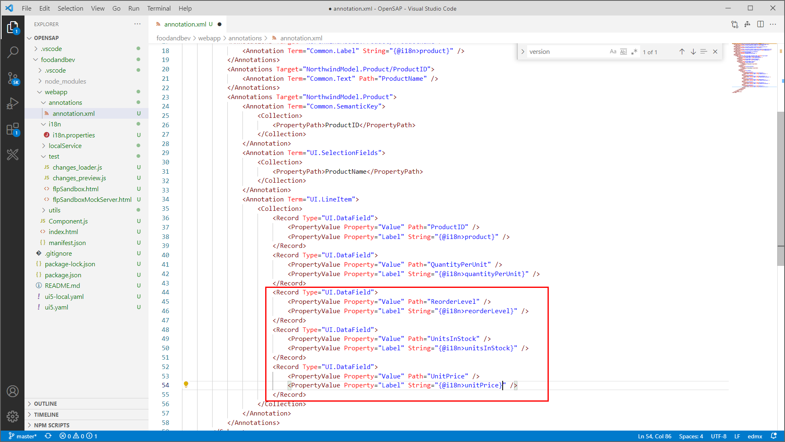

6. **Save** the annotation file and switch to the application preview in the browser. Translatable labels are now displayed as column titles.

    Note: In SAP Business Application Studio, auto save feature is enabled by default.

    


## Step 6. Add header information

In this step, you define a header for your SAP Fiori elements application.

1. To define the header information for the application, apply the annotation **UI.HeaderInfo** to the main entity type **Product**.

    Mandatory properties are inserted along with the annotation.

    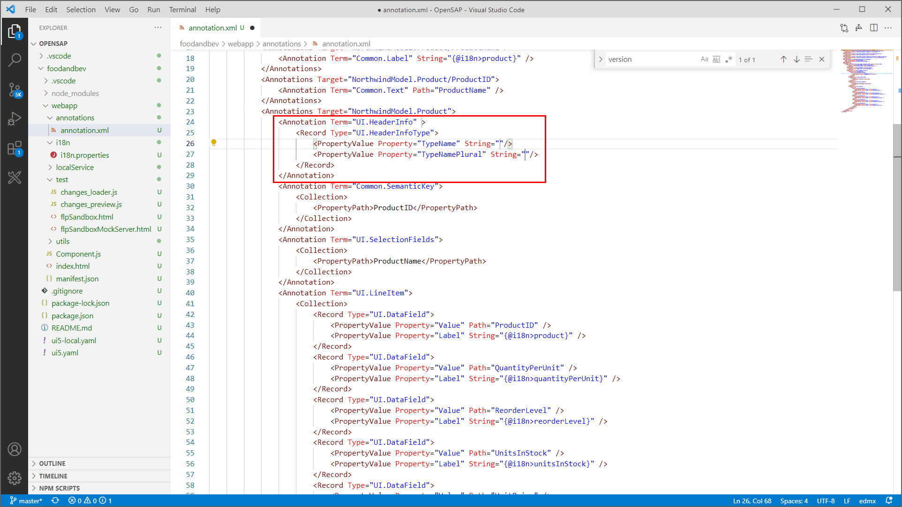

2. The value of the `TypeName` property should represent the object type, in this case `Product`. To reuse the existing text, use the code completion and choose **{&#64;i18n&gt;product}** as a value for **TypeName**.

    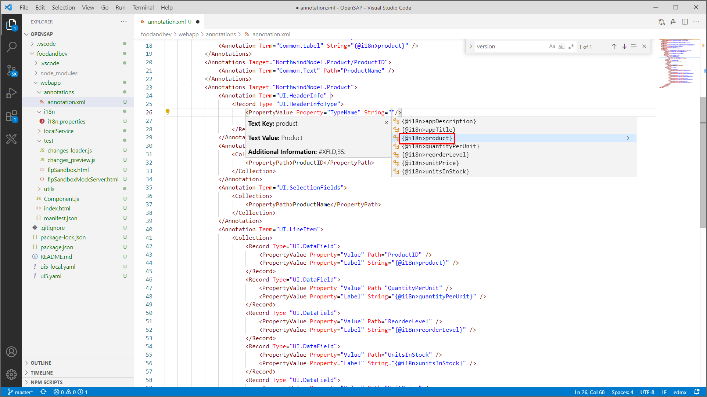


3. The value of the `TypeNamePlural` property defines the plural form of the object name, in this case `Products`. In the list report page, it will be used as a table header. As a text key for **Products** is not yet defined in the `i18n.properties` file, type it in manually as a string value for **TypeNamePlural**.  

    ```
            <Annotation Term="UI.HeaderInfo" >
                <Record Type="UI.HeaderInfoType">
                    <PropertyValue Property="TypeName" String="{@i18n>product}"/>
                    <PropertyValue Property="TypeNamePlural" String="Products"/>
                </Record>
            </Annotation>
    ```

4. **Hover** on the entered value and click **Quick Fix**. Then choose the suggested action to generate the i18n key.

    ```
            <Annotation Term="UI.HeaderInfo" >
                <Record Type="UI.HeaderInfoType">
                    <PropertyValue Property="TypeName" String="{@i18n>product}"/>
                    <PropertyValue Property="TypeNamePlural" String="{@i18n>products}"/>
                </Record>
            </Annotation>
    ```

    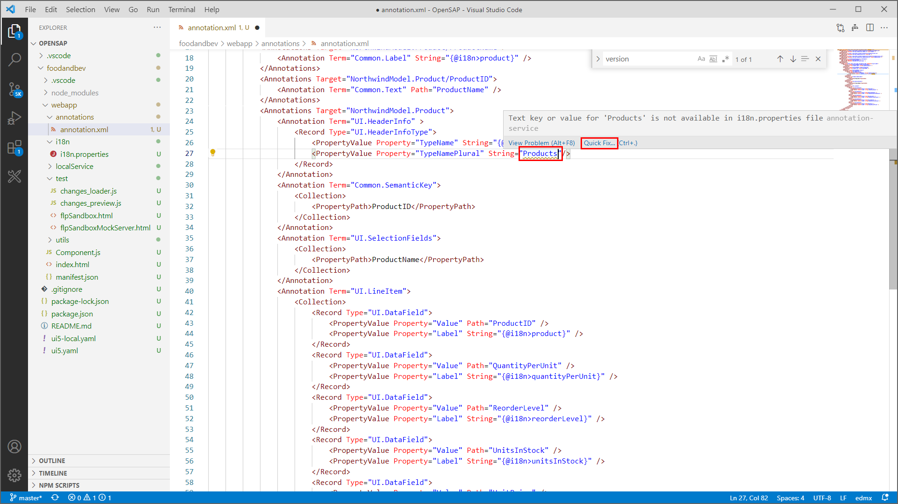

5. **Save** the annotation file and switch to the application preview in the browser. 

    Note: In SAP Business Application Studio, auto save feature is enabled by default.

    Table  header displays the `TypeNamePlural`  value of the `UI.HeaderInfo` annotation.

    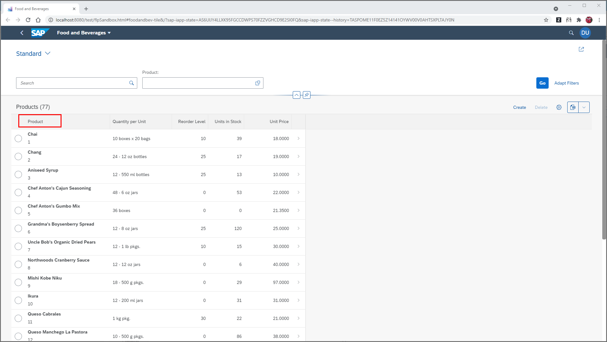


## Summary
You have completed the exercise!
In this unit, you have learned how to build an SAP Fiori elements application based on an external OData service with local annotations. 

You can now use the assisting features of XML annotation LSP to enhance your development efficiency when working with annotations in a code editor:
-	Code completion to add annotations and their properties
-	Quick Fixes to generate translation text keys
-	Go to Definition / Peek Definition to view and update the translation keys

## Next Exercise
[Week 3 Unit 6: Using XML annotation LSP for defining advanced UI features](unit6.md)
