# Hands-on exercise for week 3 unit 6:<br/>Using XML annotation LSP for defining advanced UI features

## Previous exercise
[Hands-On exercise for week 3 unit 5: Building an SAP Fiori elements app with an external OData service](unit5.md)

## Video on openSAP.com platform
[Using XML annotation LSP for defining advanced UI features](https://open.sap.com/courses/fiori-ea1/items/7204eWAMNTXWJD47PpjMRn)

## Introduction
In this unit, you will learn how annotation LSP can further help you to enhance the list report application built in the previous unit with some advanced annotation-based features. You will 
-	Visualize numeric values in the table as a micro chart,
-	Transform a filter field to a drop-down with a fixed value list and search capabilities 
-	Hide default buttons and fields that are not used in the report-style app

In this exercise, the screenshots illustrating the steps are taken from the Visual Studio Code. You can however use SAP Business Application Studio for these exercises, the steps are the same. The minor differences are described directly in the steps.

**Prerequisite: You have performed the previous exercises.**

## Step 1. Display numeric values as a bullet chart

In this step, you change the visualization of related numeric values for Units in Stock and Reorder Level to a semantically colored bullet micro chart. For this, use the code completion to add 2 new annotations: `UI.DataPoint` and `UI.Chart` using that data point. Then, update the `UI.LineItem` that represents our table to reference this `UI.Chart`.

### Define data point

1. First, define a `UI.DataPoint` annotation. For this, find the `Annotations` tag for the `Product` entity and use the code completion to add a `UI.DataPoint` annotation. 
    To use the code completion, press **CTRL+Space** on Windows or **CMD+Space** on Mac.

    To better recognize this data point in future, you can set up a qualifier. You can use the code completion again to add it and then define any meaningful string as a value, for example **StockQty**. 

    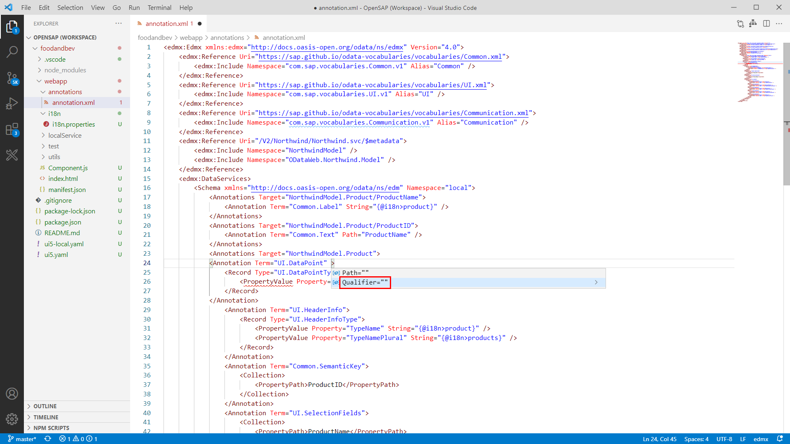

    Then place your cursor in the tag `PropertyValue Property="Value"` and use the code completion to define it as a **Path** to the numeric value to be visualized - in this case **UnitsInStock**.
    
    ```
    <Annotation Term="UI.DataPoint" Qualifier="StockQty">
        <Record Type="UI.DataPointType">
            <PropertyValue Property="Value" Path="UnitsInStock"/>
        </Record>
    </Annotation>
    ```
   

2. Next, define the criticality calculation logic. For this, add the **Criticality Calculation record** and decide on improvement direction. In this case, the more, the better, so choose **Enum Member** as an expression. 

    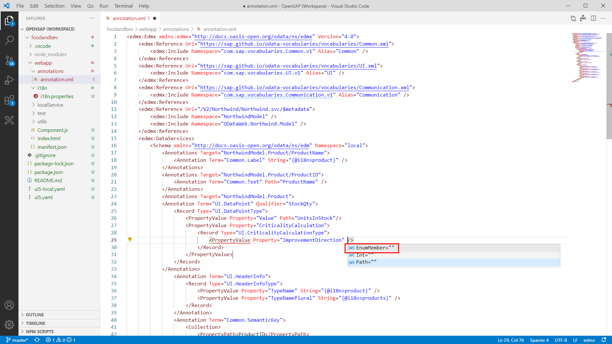

    Then choose  **Maximize**.

    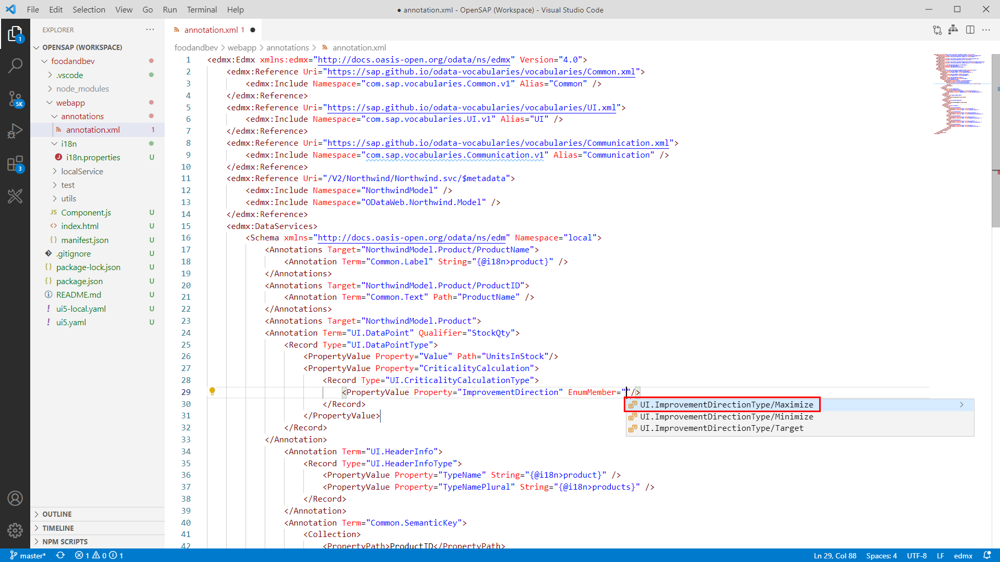
  
    ``` 
           <Annotation Term="UI.DataPoint" Qualifier="StockQty">
               <Record Type="UI.DataPointType">
                   <PropertyValue Property="Value" Path="UnitsInStock"/>
                   <PropertyValue Property="CriticalityCalculation">
                       <Record Type="UI.CriticalityCalculationType">
                           <PropertyValue Property="ImprovementDirection" EnumMember="UI.ImprovementDirectionType/Maximize"/>
                       </Record>
                   </PropertyValue>
               </Record>
           </Annotation>
    ```
         
3. Now define the comparison values for criticality calculation. First, the threshold indicating the remaining stock quantity is critical. For this, add a new  **Property "DeviationRangeLowValue"** and set it as a **Path** to **ReorderLevel**. 

    Then, add **Property "ToleranceRangeLowValue"** as a threshold indicating the stock quantity is positive. It can be equal to the deviation low value or exceed it. In this case, use the same value, thus avoiding the neutral values.
    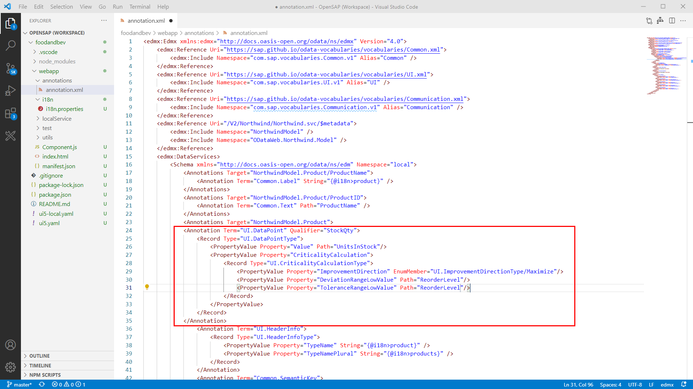

    The resulting annotation is as shown in the code fragment below.
    ```
            <Annotation Term="UI.DataPoint" Qualifier="StockQty">
                <Record Type="UI.DataPointType">
                    <PropertyValue Property="Value" Path="UnitsInStock"/>
                    <PropertyValue Property="CriticalityCalculation">
                        <Record Type="UI.CriticalityCalculationType">
                            <PropertyValue Property="ImprovementDirection" EnumMember="UI.ImprovementDirectionType/Maximize"/>
                            <PropertyValue Property="DeviationRangeLowValue" Path="ReorderLevel"/>
                            <PropertyValue Property="ToleranceRangeLowValue" Path="ReorderLevel"/>
                        </Record>
                    </PropertyValue>
                </Record>
            </Annotation>
    ```
### Define chart
4. Now, `UI.DataPoint` is defined, and we can add a `UI.Chart` annotation referencing it. For this, add a new line right after the `</Annotation>` tag for `UI.DataPoint` and use the code completion and add a **UI.Chart** annotation. 

    Again, if you would expect to have more than one chart in this app, you can add a qualifier. It is often convenient to use the same qualifier as in the `UI.DataPoint` to be referenced in this `UI.Chart`, so in this case **StockQty**. 

    Next, you decide on the chart type. The property for that - **Chart Type** - is already provided. Just place your cursor in that tag and choose **EnumMember** as an expression type and **UI.ChartType/Bullet** as a value. 
    
    Note that different chart types may require different properties in the respective `UI.DataPoint`.
    
    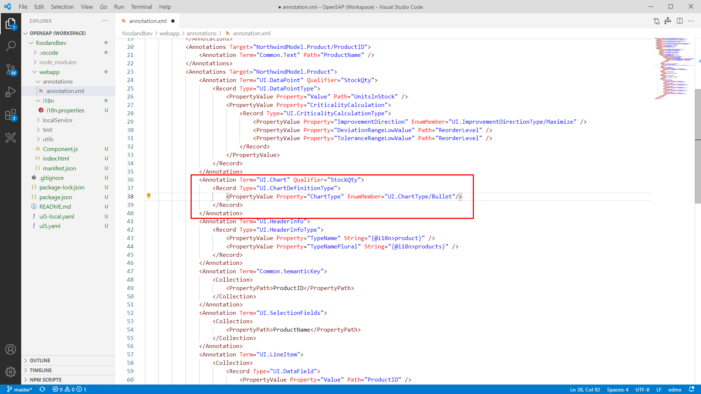
    
5. Next, add a measure for the chart. For this, add a new property **Measures** using the code completion and then choose **UnitsInStock** as a property path. Note that this value must be the same as in the `UI.DataPoint`. 

    ```
 		<Annotation Term="UI.Chart" Qualifier="StockQty">
                    <Record Type="UI.ChartDefinitionType">
                        <PropertyValue Property="ChartType" EnumMember="UI.ChartType/Bullet" />
                        <PropertyValue Property="Measures">
                            <Collection>
                                <PropertyPath>UnitsInStock</PropertyPath>
                            </Collection>
                        </PropertyValue>
                    </Record>
                </Annotation>
    ```
6. Finally, add one more property **MeasureAttributes**. Then use the code completion to Add **Property DataPoint** and then again to choose the **@UI.DataPoint#StockQty**

    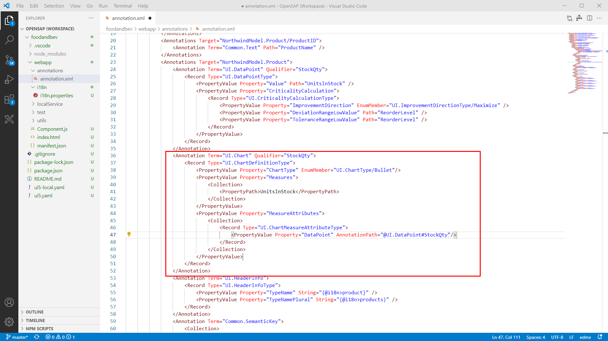

    ```
 		<Annotation Term="UI.Chart" Qualifier="StockQty">
                    <Record Type="UI.ChartDefinitionType">
                        <PropertyValue Property="ChartType" EnumMember="UI.ChartType/Bullet" />
                        <PropertyValue Property="Measures">
                            <Collection>
                                <PropertyPath>UnitsInStock</PropertyPath>
                            </Collection>
                        </PropertyValue>
                        <PropertyValue Property="MeasureAttributes">
                            <Collection>
                                <Record Type="UI.ChartMeasureAttributeType">
                                    <PropertyValue Property="DataPoint" AnnotationPath="@UI.DataPoint#StockQty" />
                                </Record>
                            </Collection>
                        </PropertyValue>
                    </Record>
                </Annotation>
    ```
    If you happen to forget how you defined your data point or need to make changes to the definition, use **CTRL+Click** to navigate to the definition of your referenced annotation. 

    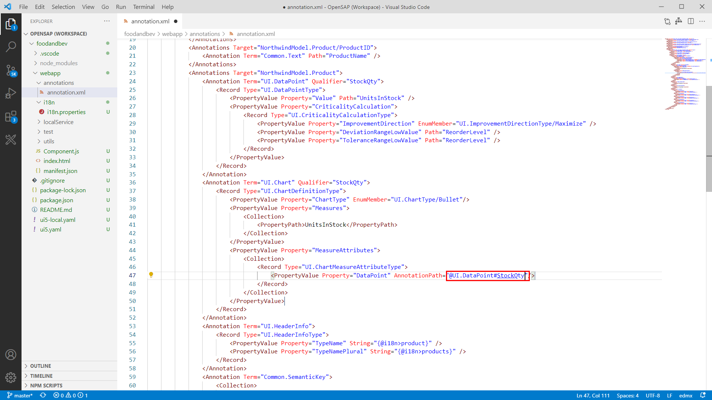

    You can always get back to your parent annotation by using go to references.

    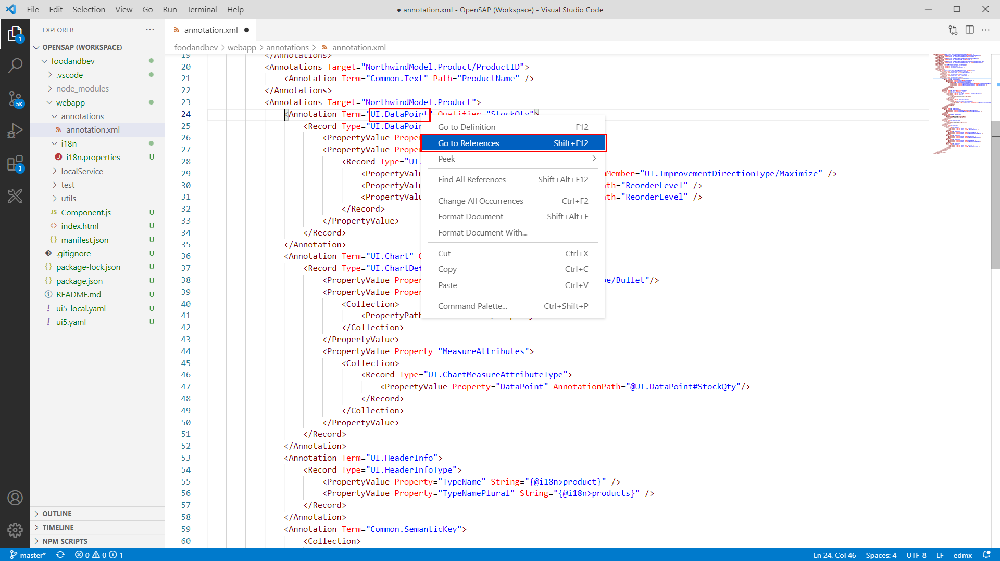
    
### Display chart in table

7. Now the chart is defined and we just need to reference it in our `UI.LineItem` to get it displayed in the table. Decide where in line item we want to show it, for example, right next to the **Units in Stock** column for better comparison, and add a new line after the respective `UI.DataField` record. 

    Then use the code completion to add a new record, in this case **DataFieldForAnnotation**. 

    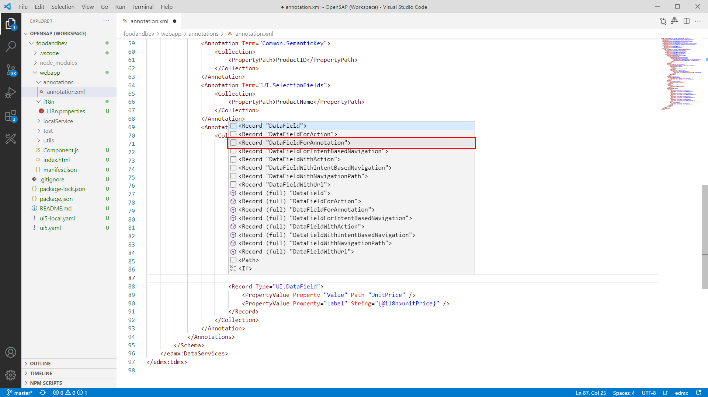   

8. In the **Annotation Path**, use the code completion to choose the chart defined in the previous steps, namely **@UI.Chart#StockQty**. 

    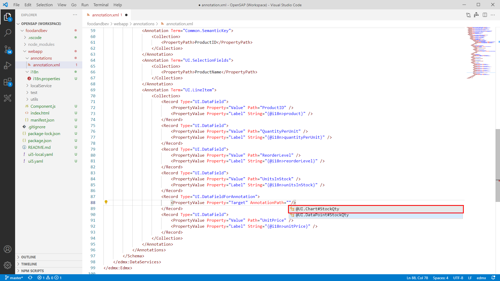

    Now use the code completion to add a label as you did in the previous unit for the other `UI.DataField` records. Use the code completion again, to choose the existing text key reference **{@i18n>unitsInStock}**.

   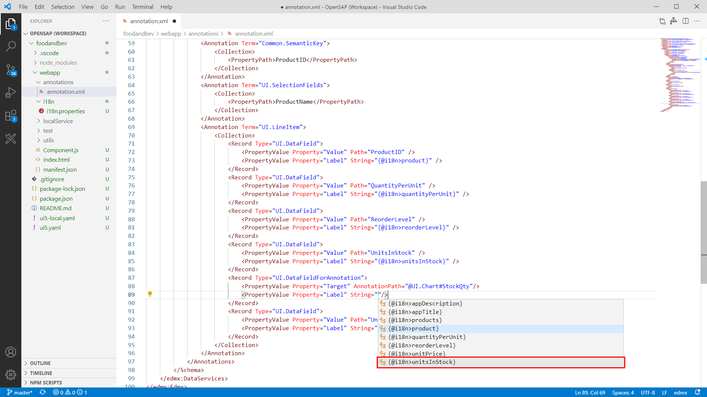

   As a result, the UI.LineItem annotation is now updated as shown in the code fragment below.

    ```
            <Annotation Term="UI.LineItem">
                <Collection>
                    <Record Type="UI.DataField">
                        <PropertyValue Property="Value" Path="ProductID"/>
                        <PropertyValue Property="Label" String="{@i18n>product}"/>
                    </Record>
                    <Record Type="UI.DataField">
                         <PropertyValue Property="Value" Path="QuantityPerUnit"/>
                         <PropertyValue Property="Label" String="{@i18n>quantityPerUnit}"/>
                    </Record>
                    <Record Type="UI.DataField">
                        <PropertyValue Property="Value" Path="ReorderLevel"/>
                        <PropertyValue Property="Label" String="{@i18n>reorderLevel}"/>
                    </Record>
                    <Record Type="UI.DataField">
                        <PropertyValue Property="Value" Path="UnitsInStock"/>
                        <PropertyValue Property="Label" String="{@i18n>unitsInStock}"/>
                    </Record>
                    <Record Type="UI.DataFieldForAnnotation">
                        <PropertyValue Property="Target" AnnotationPath="@UI.Chart#StockQty"/>
                        <PropertyValue Property="Label" String="{@i18n>unitsInStock}"/>
                    </Record>
                    <Record Type="UI.DataField">
                        <PropertyValue Property="Value" Path="UnitPrice" />
                        <PropertyValue Property="Label" String="{@i18n>unitPrice}"/>
                    </Record>
                </Collection>
            </Annotation>

    ```   
9. **Save** the annotation file. 

    Note: In SAP Business Application Studio, auto save feature is enabled by default.

### Preview the result
    
Start the application preview if not yet done.   
    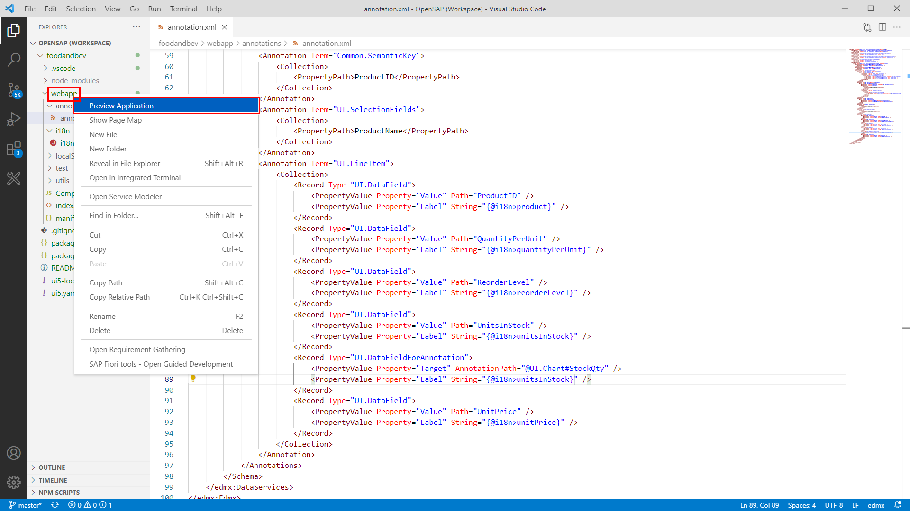

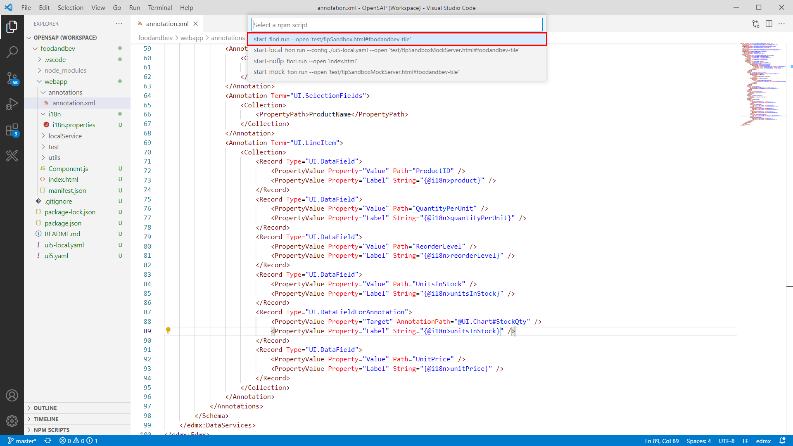
    
In the application preview, click **Go** to populate the table. 
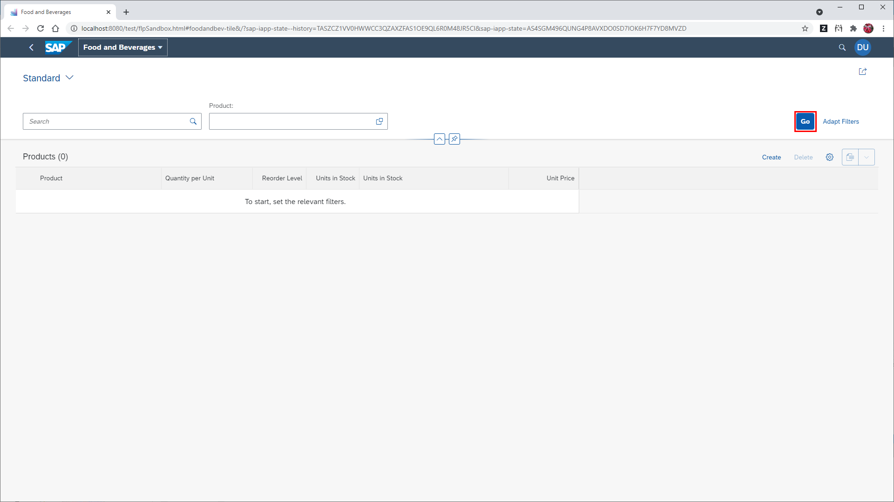

Now you can see a micro chart visualizing the number of units in stock in relation to the Reorder Level. 


Note: The old column for **Units in Stock** is now redundant, and can be removed from the table simply by deleting the respective `UI.DataField` record from the `UI.LineItem`annotation.

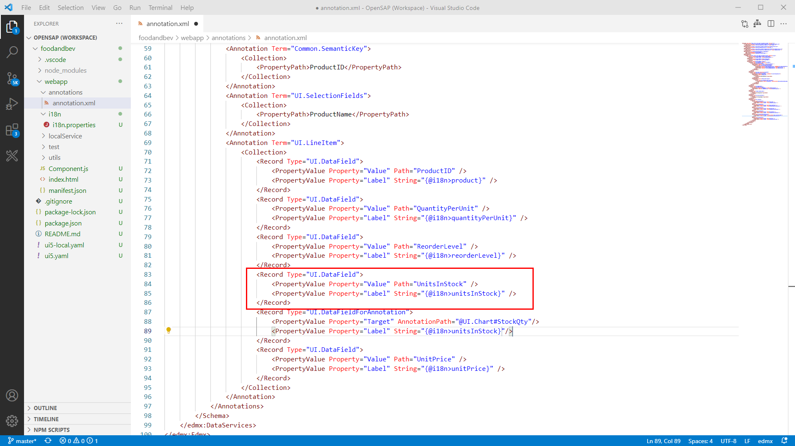

## Step 2. Display value list in the filter field 
The basic filter field created in the previous unit only enables setting the filter by searching for the respective value. For this, the user needs to know the which values could possibly exist. This would fit some scenarios, but for others it would be more convenient, if the filter field displays a list of the available values to choose from. 
You can convert a basic filter field to a value help with the pre-defined values, if the underlying OData service contains an entity representing the list of such values. 

The Northwind service used in this unit already contains an entity set `Alphabetical_list_of_products` that can be used as a list of values for the `Product` filter. You can check this in the **webapp/localService/metadata** file of your application project. 
   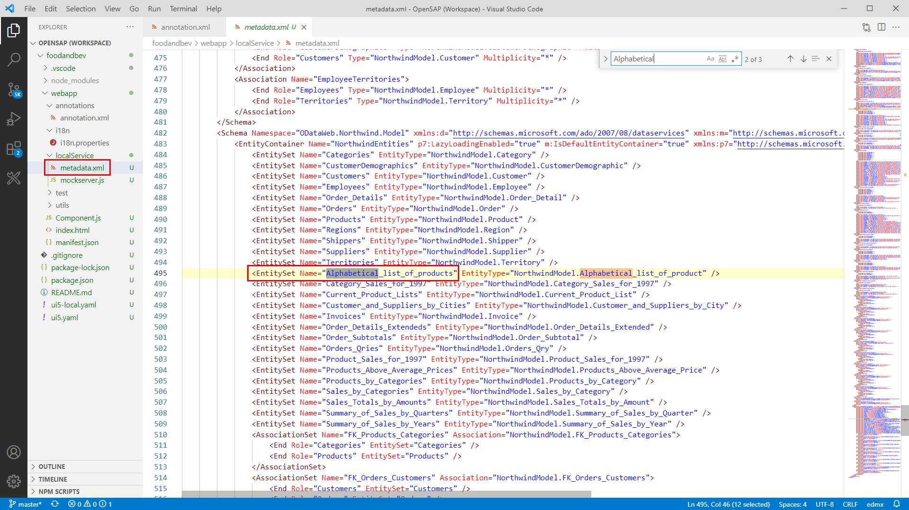

In this step, you apply the `Common.ValueList` annotation to the property used as filter field (`Product Name`) to connect it with this entity set. Then you can apply also the annotation `Common.ValueListWithFixedValues` to display it as a combo box. For this, you can use the code completion and vocabulary definition features integrated in the XML annotation LSP.

### Define value list
1. In the local annotation file, find the annotation target **NorthwindModel.Product/ProductName**, add a new line before or after the existing **Common.Label** annotation and use the code completion to add **Common.ValueList**.

    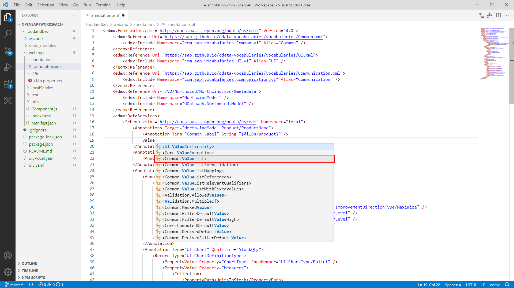

2. As a collection path, use **Alphabetical_list_of_products** - the exact name of the entity set containing the list of product names.
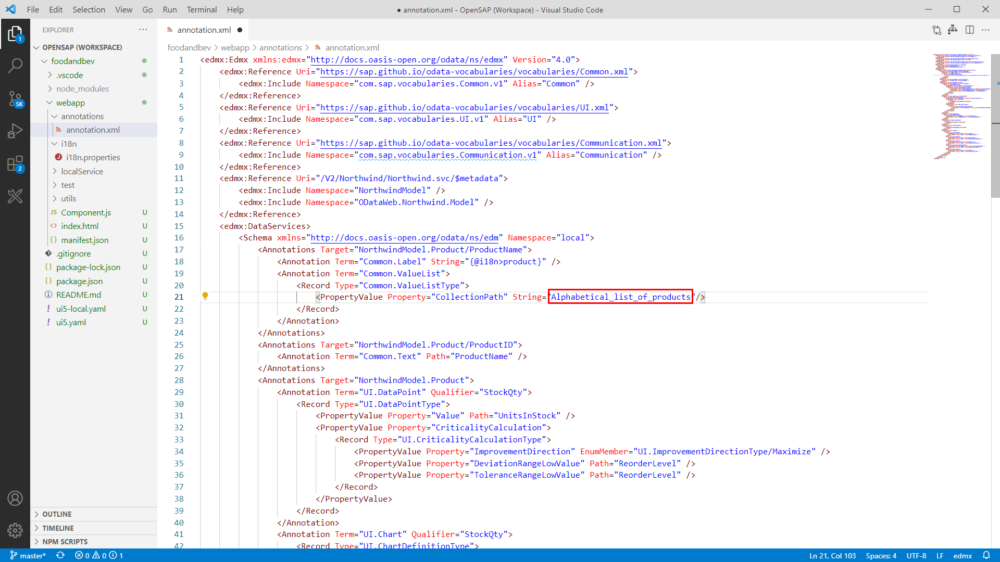

3. Then, add a new line after it and add **Property "Parameters"** 
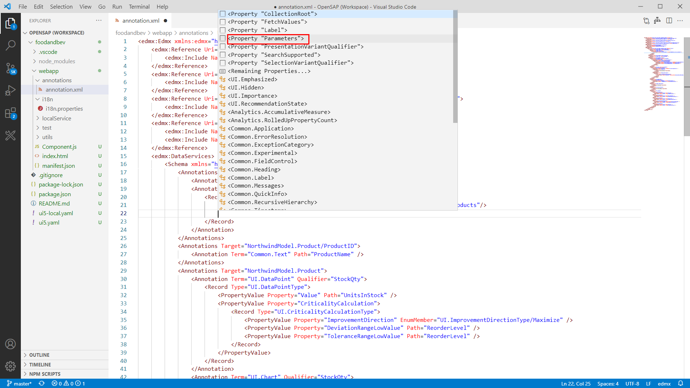

4. In the collection, use the code completion to add **Record "ValueListParameterInOut"**. 
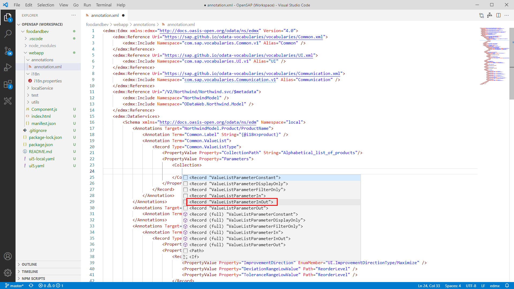

5. As a value for **LocalDataProperty**, choose **ProductName** - the same property you chose for the filter field.
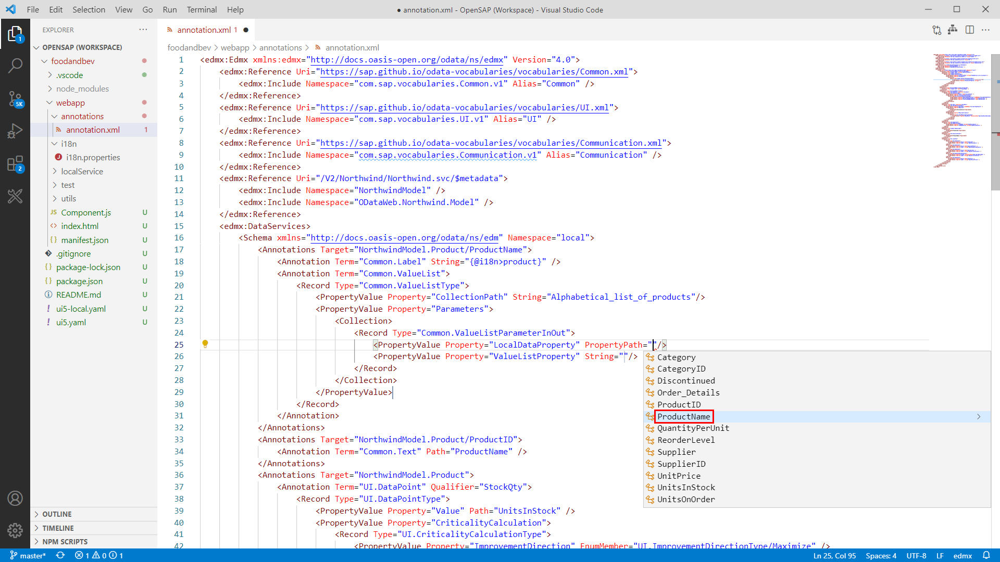

6.  As a value for **ValueListProperty**, use **ProductName**.    
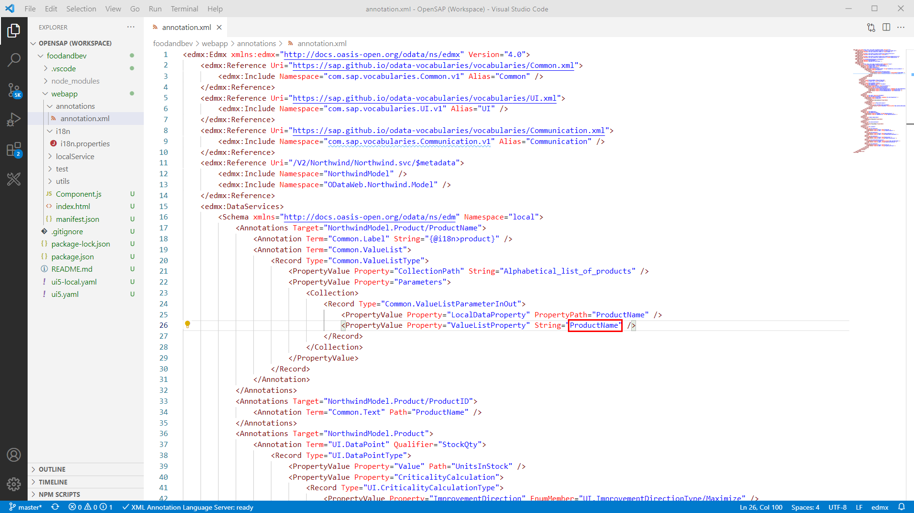

    The string used in the `ValueListProperty` must match one of the properties of the entity type corresponding to the entity set `Alphabetical_list_of_products` used as a collection path. You can check in the local metadata file, which entity type corresponds to the selected entity set.

     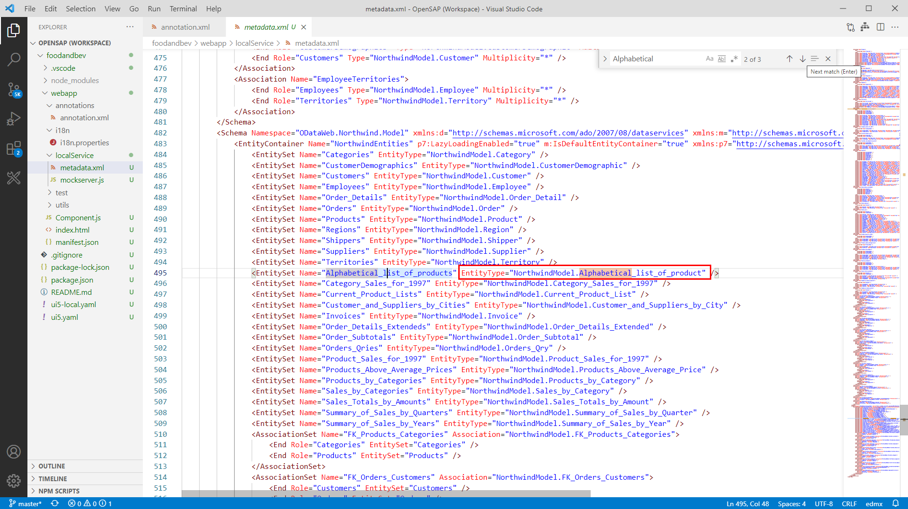
    
    You can also check in the local metadata file, which properties this entity type contains.  In this service, the name of the property we used in the `ValueListProperty` is the same as the property of our main entity type used in the filter but this can vary from service to service.

    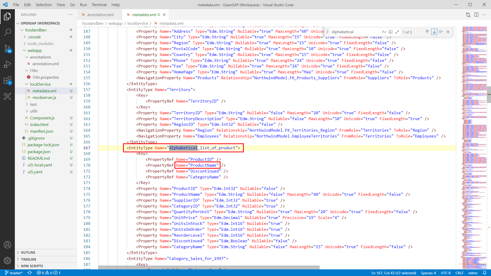
    
    The resulting annotation is shown in the code fragment below. It connects the property of the main entity defined as `LocalDataProperty` with the property of the `Alphabetical_list_of_products` defined as `ValueListProperty`. 
    ```
                <Annotation Term="Common.ValueList">
                    <Record Type="Common.ValueListType">
                        <PropertyValue Property="CollectionPath" String="Alphabetical_list_of_products" />
                        <PropertyValue Property="Parameters">
                            <Collection>
                                <Record Type="Common.ValueListParameterInOut">
                                    <PropertyValue Property="LocalDataProperty" PropertyPath="ProductName" />
                                    <PropertyValue Property="ValueListProperty" String="ProductName" />
                                </Record>
                            </Collection>
                        </PropertyValue>
                    </Record>
                </Annotation>
    ```
7. **Save** the annotation file. 

    Note: In SAP Business Application Studio, auto save feature is enabled by default.

### Preview the result
    
In the application preview, click **Value Help** icon to see the list of available values. 

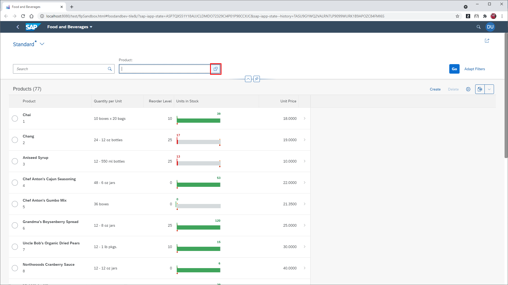

Choose one or more values to be used as filters and click **OK**.

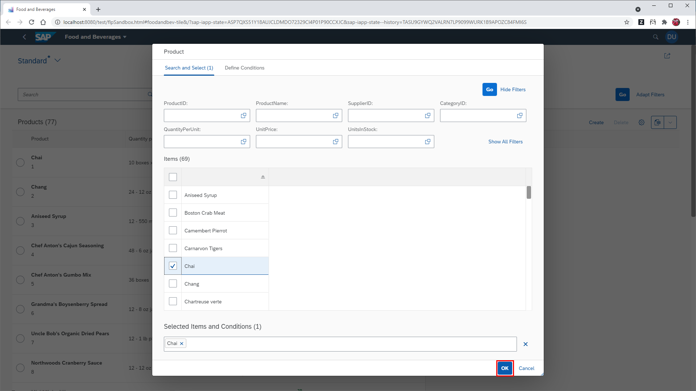

Click  **Go**.
    
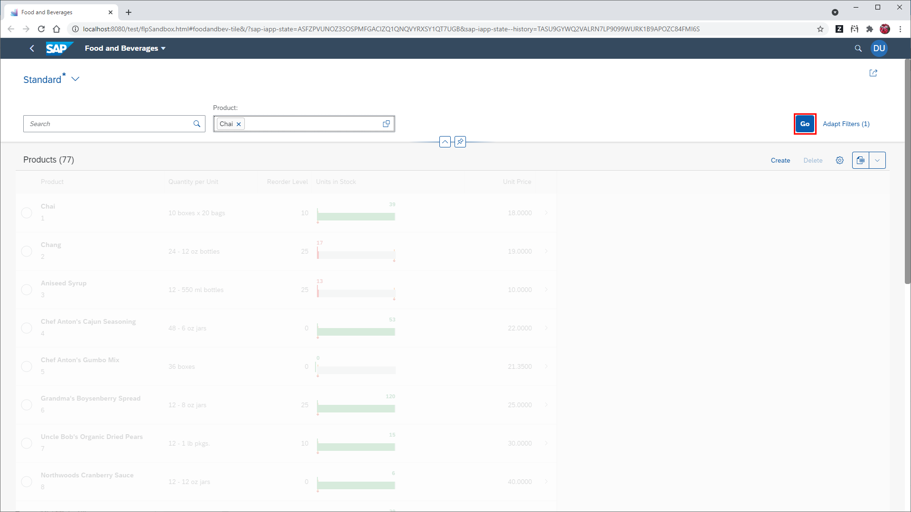

The table is filtered to match your selection.

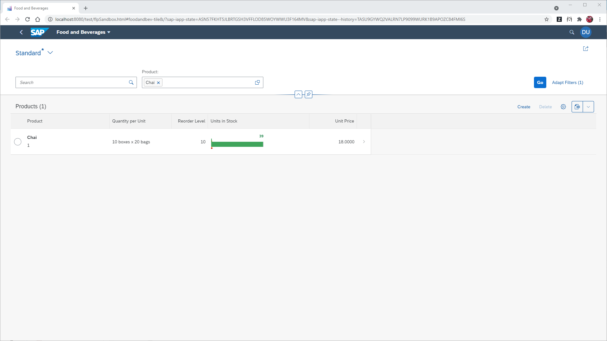

### Display filter field as a combo box

For lists containing up to 200 entries, it is recommended to use the standard combo box control. For this, you annotate the property used in filter with the annotation `Common.ValueListWithFixedValues` in addition to the `Common.ValueList` annotation defined earlier in this unit. 

8. Use  the code completion to add the **Common.ValueListWithFixedValue** annotation to the Annotations Target **NorthwindModel.Product/ProductName**.
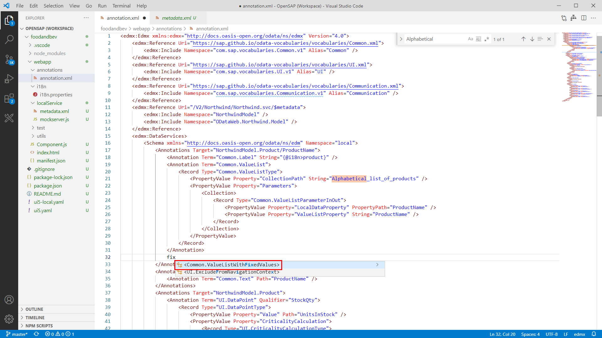

    The resulting annotation is shown in the code fragment below.
    ```
    <Annotation Term="Common.ValueListWithFixedValues" />
    ```
    Please note that you do not need to define the value explicitly if the default value of the `boolean` or `tag` annotation (in this case `true`) fits your needs. The default annotation value will be take effect if no value is defined. 

    To find out the default value of annotation, you can use the integrated vocabulary definition feature of XML annotation LSP. 

    Hover over an annotation or its element in the annotation file to see the most important vocabulary information for it, including its type, default value (if defined) or applicable restrictions.
        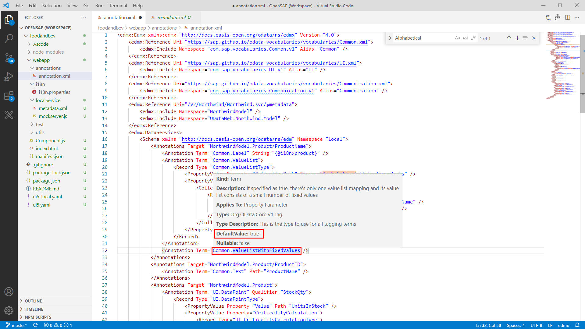

    The same information you can get from completion lists by clicking on the **Read More** button in the highlighted suggestion. Alternatively, you can press **CTRL+Space** again when the suggestion list is open.
        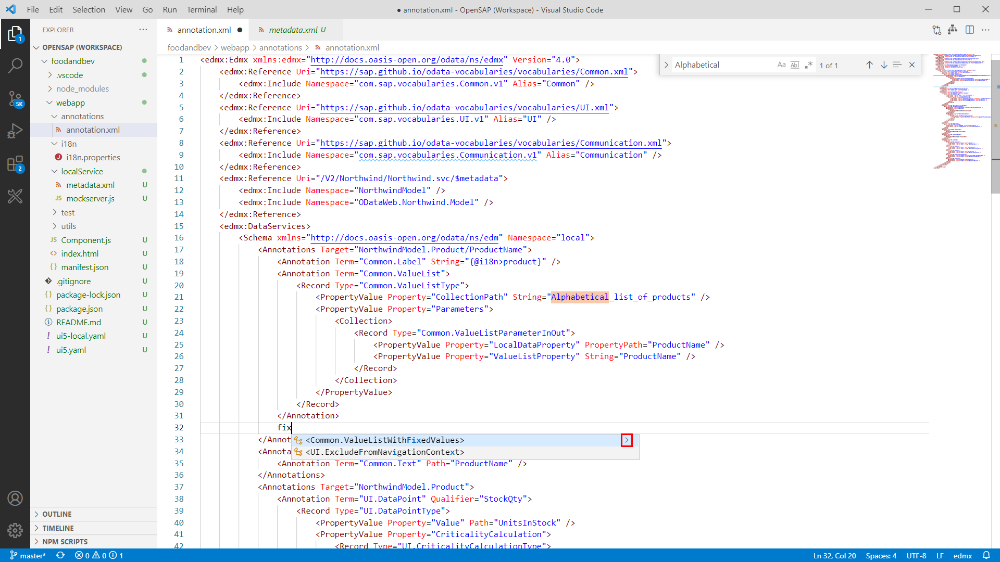

    The Quick Info window displaying vocabulary information will be available for all items in the completion list until you close it.
    

9. **Save** the annotation file. 

    Note: In SAP Business Application Studio, auto save feature is enabled by default.

### Preview the result

In the application preview, value help is displayed as a combo box. Open it up to see the list of available values. 

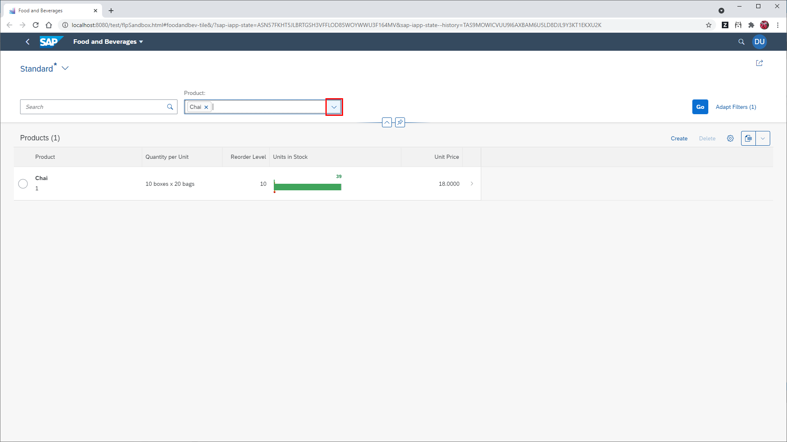

Choose one or more values to be used as filters. You can also type in the values to shorten the list. Click  **Go**.

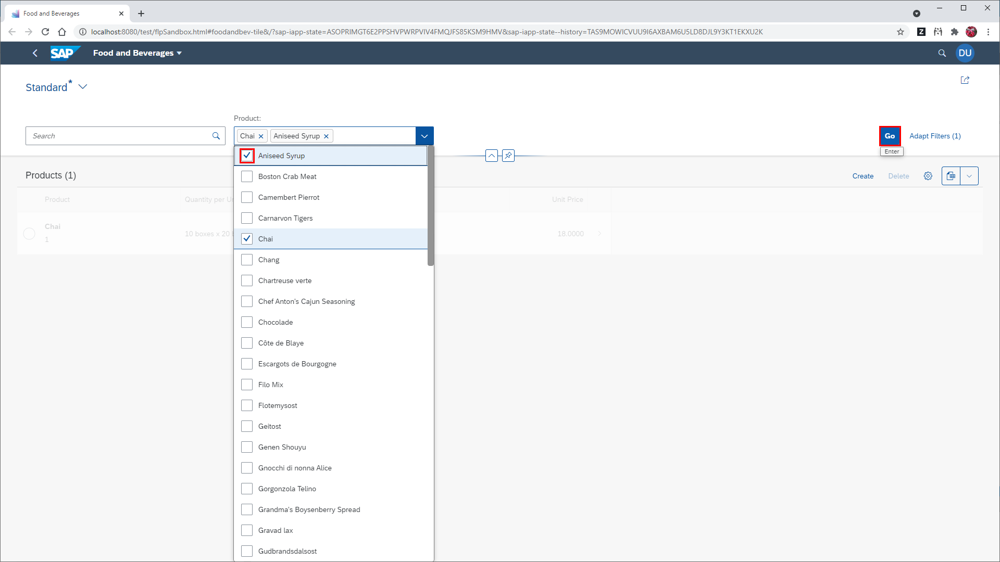

The table is filtered to match your selection.

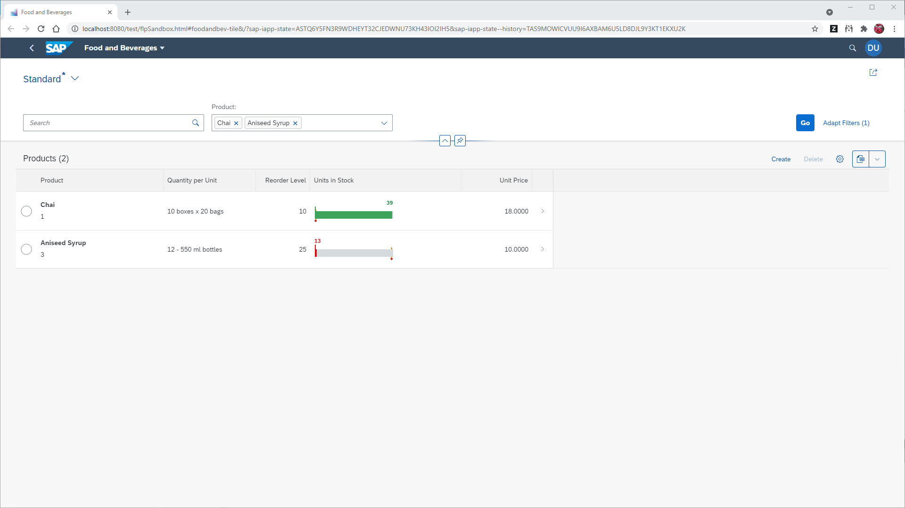


   

## Step 3. Hide irrelevant default features 
In this step, you hide the default features that are not relevant for the report-like applications on read-only services. The XML annotation LSP features such as code completion and diagnosis will help you with this.

### Hide search field
This unit shows that it is possible to build Fiori applications using external services similarly to the applications based on ABAP services. There is an exception though. The application search is NOT supported for **external** services of **OData V2**. If you build your app with OData V4 services, you do not have this limitation regardless of the service source. As this unit is based on an OData V2 service, it makes sense to hide the default search field to avoid confusing the end users. 

For this, you apply the annotation `Capabilities.SearchRestrictions` to the main entity set and define its property `Searchable` as `false`.

1. Inside the **Schema** tag, use the code completion and choose **Annotations**. Then use the code completion again to choose the main entity set: 
    - choose the entity container **ODataWeb.Northwind.Model.NorthwindEntities** as it is a parent for all entity sets
    - type **/** 
    - choose **Products** 
2. In the **Annotations** tag, use the code completion to choose **Capabilities.SearchRestrictions**.

3. As the OData vocabulary `Org.OData.Capabilities.V1` is not yet referenced in the annotation file header, the diagnostic shows an error message informing us about it. It comes with a dedicated quick fix action letting you add this reference with one click. Hover over the error, and click **Quick Fix** or use **CTRL+.**.
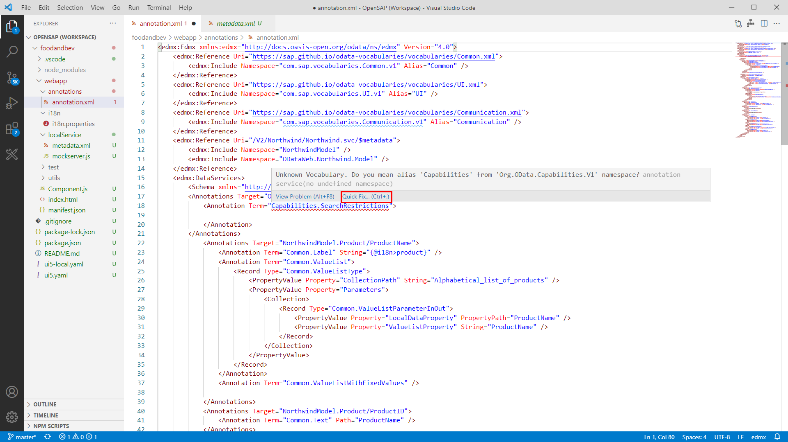
    
    Click on the suggested fix **Add a reference to Org.OData.Capabilities.V1 namespace**.
    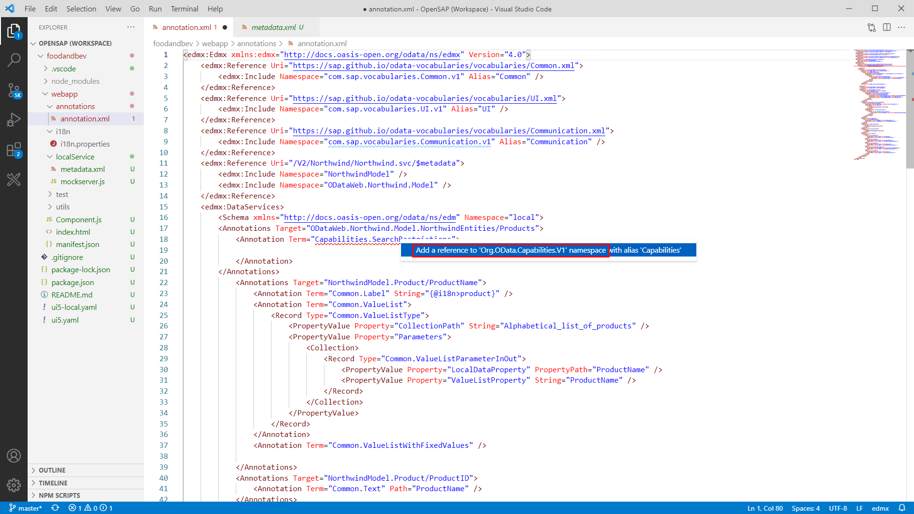

    The vocabulary is now referenced in the annotation file header and the error is resolved. 
    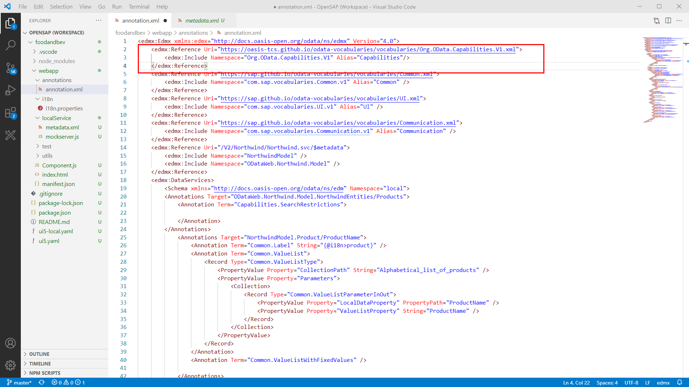

4. Use the code completion to add **Record "Capabilities.SearchRestrictionsType"**. Then use it again to add **Property "Searchable"**. 

5. As the default value of this `Boolean` property is `true`, you need to explicitly set it to false to remove the search field. For this, place the cursor before the closing bracket of the **PropertyValue** tag, add space and use the code completion to choose expression type **Bool**. 
    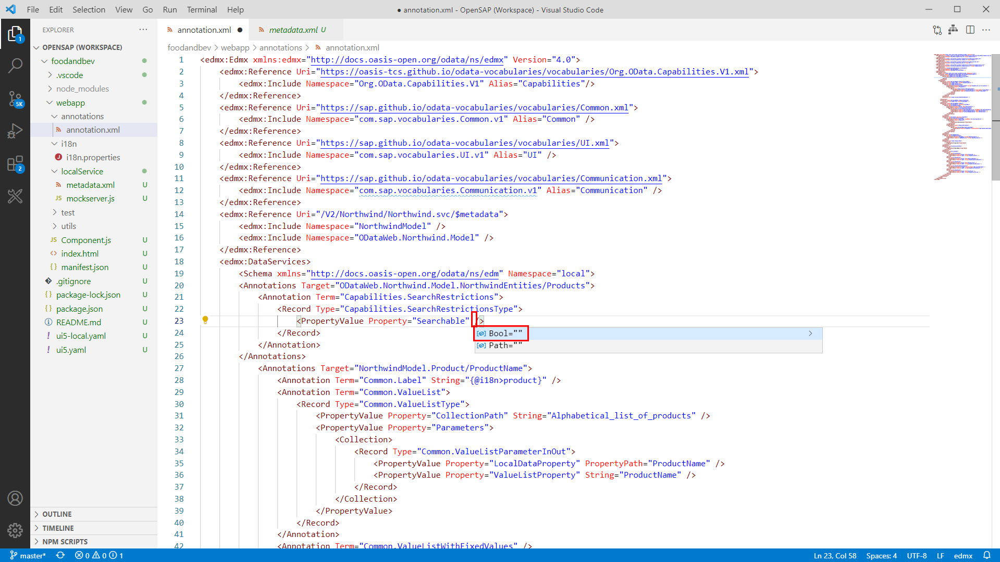

    Then use the code completion again to set it to **false**.
    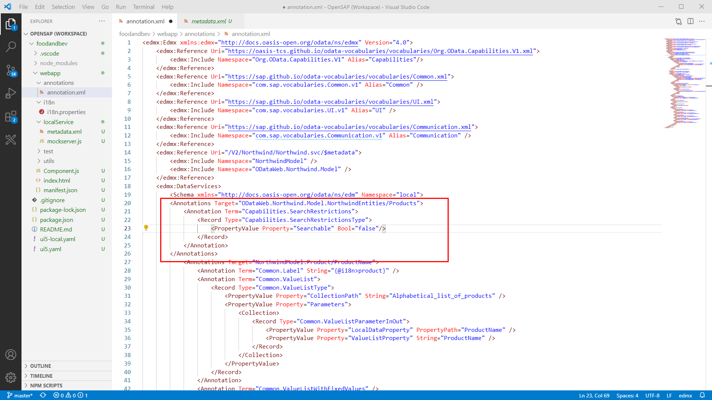

    The resulting annotation is shown in the code fragment below.
    ```
            <Annotations Target="ODataWeb.Northwind.Model.NorthwindEntities/Products">
                <Annotation Term="Capabilities.SearchRestrictions">
                    <Record Type="Capabilities.SearchRestrictionsType">
                        <PropertyValue Property="Searchable" Bool="false" />
                    </Record>
                </Annotation>
            </Annotations>
    ```

    When the changes are saved, the search field is no longer visible in preview.
    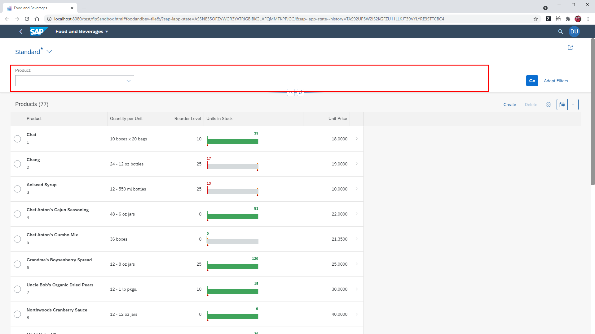

### Hide table header buttons
Similarly, you can remove the default buttons `Create` and `Delete` in the table header. As this app is just a report and the end user is not supposed to add or delete products, it makes sense to hide these unnecessary buttons to avoid the confusion.

For this, you apply annotations introducing the insert and delete restrictions to the main entity set using the code completion. 

6. To indicate the data for the entity set cannot be deleted, use code completion to add **Capabilities.DeleteRestrictions**. Then use it again to add the property **Deletable**. As its default value is true and the goal is to hide the Delete button, add **Bool** as an expression type value and set its value to **false** as explained previously.
    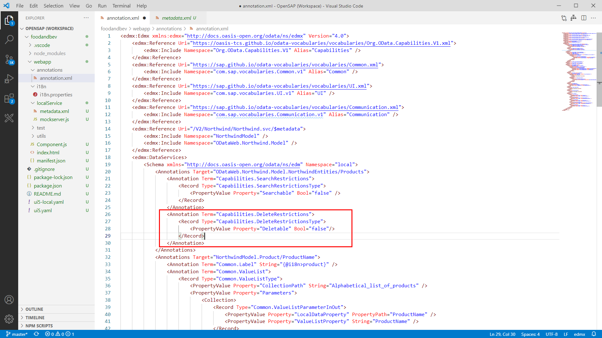

    The resulting annotation is shown in the code fragment below.

    ```
                <Annotation Term="Capabilities.DeleteRestrictions">
                    <Record Type="Capabilities.DeleteRestrictionsType">
                        <PropertyValue Property="Deletable" Bool="false" />
                    </Record>
                </Annotation>
    ```

7. Similarly, hide the Create button: use code completion to add **Capabilities.InsertRestrictions** and then property **Insertable**. Set its expression type to **Bool** and value to **false**.  to 
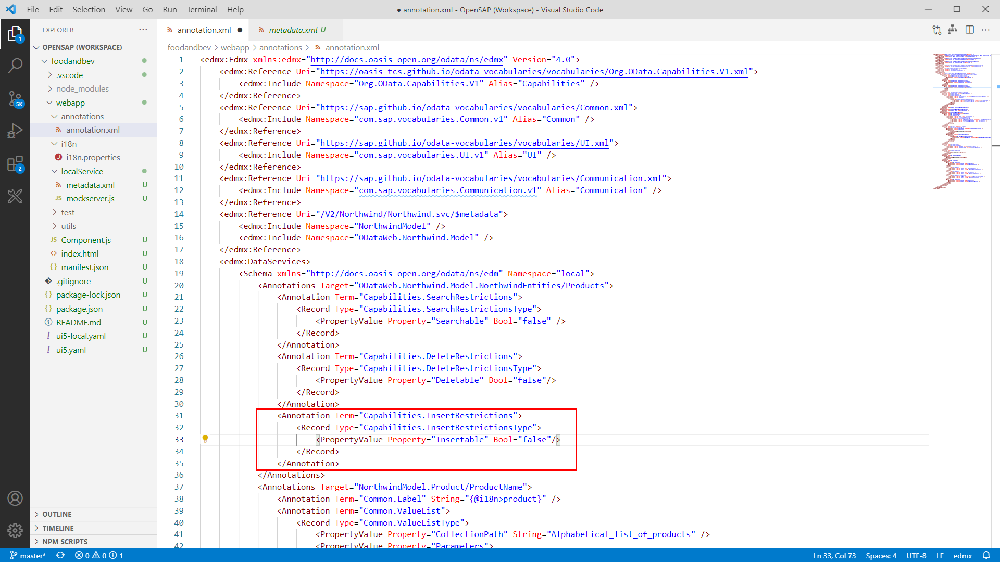

    The resulting annotation is shown in the code fragment below.

    ```
                <Annotation Term="Capabilities.InsertRestrictions">
                    <Record Type="Capabilities.InsertRestrictionsType">
                        <PropertyValue Property="Insertable" Bool="false" />
                    </Record>
                </Annotation>
            </Annotations>
     ```

6. **Save** the annotation file. 

    Note: In SAP Business Application Studio, auto save feature is enabled by default.

###  Preview the result

In the application preview, Create and Delete buttons are no longer visible in the table header

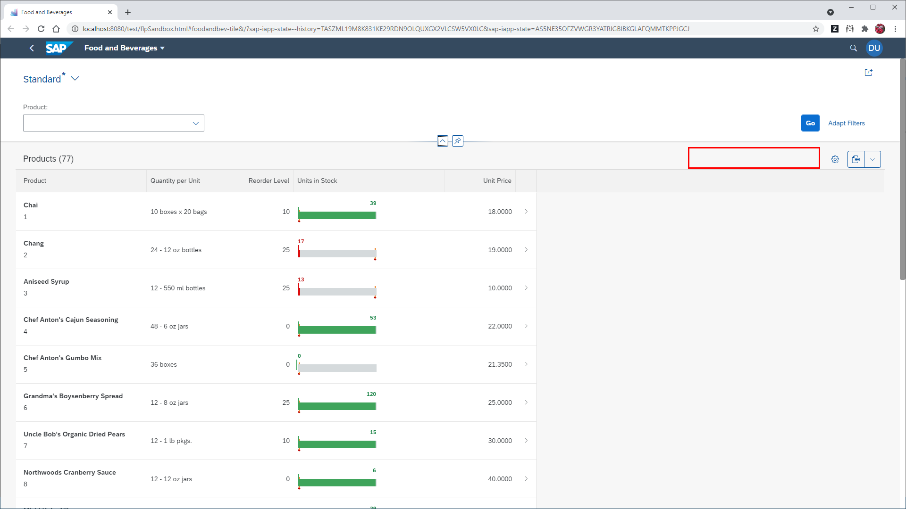


## Summary
You have completed the exercise!
In this unit, you have learned how to use the following XML annotation LSP features to conveniently add and edit local annotations in the code editor:
- Input help with code completion suggestions
- Built-in validation checks and quick-fix actions
- Navigation to referenced annotations 
- Integrated vocabulary definitions
- Where-used lookup for annotations
- Internationalization (i18n) support


